# Entity Relationship Diagram (ERD)
## FMH Animal Clinic System

---

## Overview

This ERD represents the database structure of the FMH Animal Clinic Management System, a comprehensive veterinary practice management application built with Django.

---

## Mermaid ERD Diagram

```mermaid
erDiagram
    %% ═══════════════════════════════════════════════════════════════
    %% CORE ENTITIES
    %% ═══════════════════════════════════════════════════════════════
    
    Branch {
        int id PK
        string name UK
        string branch_code UK
        string phone_number
        string email
        string address
        string city
        string clinic_license_number
        text operating_hours
        boolean is_active
        string google_maps_embed_url
        string facebook_url
    }
    
    User {
        int id PK
        string username UK
        string email
        string password
        string first_name
        string last_name
        string phone_number
        text address
        image profile_picture
        int assigned_role_id FK
        int branch_id FK
        boolean is_superuser
        boolean is_staff
    }
    
    Role {
        string code PK
        string name UK
        text description
        int hierarchy_level
        boolean is_staff_role
        boolean is_system_role
        boolean restrict_to_branch
    }
    
    Module {
        string code PK
        string name
        text description
        string icon
        string url_name
        string parent_id FK
        int display_order
        boolean is_active
    }
    
    ModulePermission {
        int id PK
        int role_id FK
        string module_id FK
        string permission_type
    }
    
    SpecialPermission {
        string code PK
        string name
        text description
    }
    
    RoleSpecialPermission {
        int id PK
        int role_id FK
        string permission_id FK
    }
    
    %% ═══════════════════════════════════════════════════════════════
    %% PATIENT & APPOINTMENTS
    %% ═══════════════════════════════════════════════════════════════
    
    Pet {
        int id PK
        int owner_id FK
        string name
        string species
        string breed
        date date_of_birth
        string sex
        string color
        image photo
        string status
        string source
        string guest_owner_name
        string guest_owner_phone
        string guest_owner_email
        boolean is_active
    }
    
    Appointment {
        int id PK
        int pet_id FK
        int user_id FK
        int branch_id FK
        int preferred_vet_id FK
        int sale_id FK
        string owner_name
        string owner_email
        string owner_phone
        string pet_name
        string pet_species
        text pet_symptoms
        date appointment_date
        time appointment_time
        string reason
        string source
        string status
        text notes
    }
    
    %% ═══════════════════════════════════════════════════════════════
    %% MEDICAL RECORDS
    %% ═══════════════════════════════════════════════════════════════
    
    MedicalRecord {
        int id PK
        int pet_id FK
        int vet_id FK
        int branch_id FK
        decimal weight
        decimal temperature
        text history_clinical_signs
        text treatment
        text rx
        date ff_up
        date date_recorded
        string status
    }
    
    RecordEntry {
        int id PK
        int record_id FK
        int vet_id FK
        date date_recorded
        decimal weight
        decimal temperature
        text history_clinical_signs
        text treatment
        text rx
        date ff_up
        string action_required
    }
    
    AIDiagnosis {
        int id PK
        int pet_id FK
        int requested_by_id FK
        int reviewed_by_id FK
        text input_symptoms
        text input_history
        string primary_condition
        text primary_reasoning
        json differential_diagnoses
        json recommended_tests
        json warning_signs
        text summary
        boolean is_reviewed
        datetime reviewed_at
    }
    
    %% ═══════════════════════════════════════════════════════════════
    %% EMPLOYEES & SCHEDULING
    %% ═══════════════════════════════════════════════════════════════
    
    StaffMember {
        int id PK
        int user_id FK
        int branch_id FK
        string first_name
        string last_name
        string email
        string phone
        string position
        decimal salary
        date date_hired
        string license_number
        date license_expiry
        boolean is_active
        boolean is_deleted
    }
    
    VetSchedule {
        int id PK
        int staff_id FK
        int branch_id FK
        date date
        time start_time
        time end_time
        string shift_type
        boolean is_available
        text notes
    }
    
    RecurringSchedule {
        int id PK
        int staff_id FK
        int branch_id FK
        int day_of_week
        time start_time
        time end_time
        string shift_type
        boolean is_active
        date effective_from
        date effective_until
    }
    
    %% ═══════════════════════════════════════════════════════════════
    %% INVENTORY
    %% ═══════════════════════════════════════════════════════════════
    
    Product {
        int id PK
        int branch_id FK
        string name
        text description
        string sku UK
        string barcode
        string manufacturer
        string item_type
        decimal unit_cost
        decimal price
        int stock_quantity
        int min_stock_level
        boolean is_consumable
        date expiration_date
        boolean is_available
        boolean is_deleted
    }
    
    StockAdjustment {
        int id PK
        int product_id FK
        int branch_id FK
        string adjustment_type
        string reference
        date date
        int quantity
        decimal cost_per_unit
        string reason
    }
    
    Reservation {
        int id PK
        int user_id FK
        int product_id FK
        int quantity
        string status
        date pickup_date
        text notes
    }
    
    StockTransfer {
        int id PK
        int source_product_id FK
        int destination_branch_id FK
        int requested_by_id FK
        int processed_by_id FK
        int quantity
        string status
        text notes
    }
    
    %% ═══════════════════════════════════════════════════════════════
    %% BILLING & POS
    %% ═══════════════════════════════════════════════════════════════
    
    Service {
        int id PK
        int branch_id FK
        string name
        decimal cost
        decimal price
        string category
        string tax_rate
        int duration
        text description
        boolean active
        boolean is_deleted
    }
    
    CustomerStatement {
        int id PK
        int customer_id FK
        int branch_id FK
        int created_by_id FK
        string statement_number UK
        string patient_name
        string owner_name
        date date
        decimal consultation_fee
        decimal treatment
        decimal boarding
        decimal vaccination
        decimal surgery
        decimal laboratory
        decimal grooming
        decimal others
        decimal total_amount
        decimal deposit
        decimal balance
        string status
    }
    
    CashDrawer {
        int id PK
        int branch_id FK
        int opened_by_id FK
        int closed_by_id FK
        string status
        decimal opening_amount
        decimal expected_cash
        decimal actual_cash
        datetime opened_at
        datetime closed_at
    }
    
    Sale {
        int id PK
        int branch_id FK
        int cash_drawer_id FK
        int customer_id FK
        int pet_id FK
        int cashier_id FK
        int voided_by_id FK
        string transaction_id UK
        string customer_type
        string guest_name
        decimal subtotal
        decimal discount_amount
        decimal tax_amount
        decimal total
        decimal amount_paid
        decimal change_due
        string status
        string void_reason
    }
    
    SaleItem {
        int id PK
        int sale_id FK
        int service_id FK
        int product_id FK
        string item_type
        string name
        text description
        decimal unit_price
        int quantity
        decimal discount
    }
    
    Payment {
        int id PK
        int sale_id FK
        int received_by_id FK
        string method
        decimal amount
        string status
        string reference_number
    }
    
    Refund {
        int id PK
        int sale_id FK
        int requested_by_id FK
        int approved_by_id FK
        int processed_by_id FK
        string refund_id UK
        string refund_type
        decimal amount
        text reason
        string status
        string refund_method
    }
    
    RefundItem {
        int id PK
        int refund_id FK
        int sale_item_id FK
        int quantity
        decimal amount
    }
    
    %% ═══════════════════════════════════════════════════════════════
    %% PAYROLL
    %% ═══════════════════════════════════════════════════════════════
    
    PayrollPeriod {
        int id PK
        int released_by_id FK
        int month
        int year
        string status
        decimal total_gross
        decimal total_deductions
        decimal total_net
        int employee_count
        datetime generated_at
        datetime released_at
    }
    
    Payslip {
        int id PK
        int payroll_period_id FK
        int employee_id FK
        decimal base_salary
        int days_worked
        int days_absent
        decimal overtime_pay
        decimal holiday_pay
        decimal bonus
        decimal staff_allowance
        decimal sss
        decimal philhealth
        decimal pagibig
        decimal tax
        decimal cash_advance
        decimal gross_pay
        decimal total_deductions
        decimal net_pay
        string status
    }
    
    PayrollAuditLog {
        int id PK
        int user_id FK
        int payroll_period_id FK
        int payslip_id FK
        int staff_member_id FK
        string action_type
        text description
        json metadata
        string ip_address
    }
    
    %% ═══════════════════════════════════════════════════════════════
    %% NOTIFICATIONS
    %% ═══════════════════════════════════════════════════════════════
    
    FollowUp {
        int id PK
        int appointment_id FK
        int created_by_id FK
        string pet_name
        date follow_up_date
        date follow_up_end_date
        text reason
        boolean is_completed
    }
    
    Notification {
        int id PK
        int user_id FK
        int related_follow_up_id FK
        string title
        text message
        string notification_type
        int related_object_id
        boolean is_read
    }
    
    %% ═══════════════════════════════════════════════════════════════
    %% ACTIVITY LOGS
    %% ═══════════════════════════════════════════════════════════════
    
    UserActivity {
        int id PK
        int user_id FK
        string action
        string object_name
        datetime timestamp
    }
    
    ActivityLog {
        int id PK
        int user_id FK
        int branch_id FK
        string action
        string category
        text details
        datetime timestamp
    }
    
    %% ═══════════════════════════════════════════════════════════════
    %% SETTINGS & CMS
    %% ═══════════════════════════════════════════════════════════════
    
    SystemSetting {
        string key PK
        text value
        string value_type
        string category
        boolean is_sensitive
    }
    
    ClinicProfile {
        int id PK
        string name
        image logo
        string email
        string phone
        text address
        string tagline
    }
    
    %% ═══════════════════════════════════════════════════════════════
    %% RELATIONSHIPS
    %% ═══════════════════════════════════════════════════════════════
    
    %% Branch Relationships
    User }o--|| Branch : "belongs_to"
    StaffMember }o--|| Branch : "works_at"
    Product }o--|| Branch : "stocked_at"
    Appointment }o--|| Branch : "scheduled_at"
    Sale }o--|| Branch : "transacted_at"
    MedicalRecord }o--|| Branch : "recorded_at"
    VetSchedule }o--|| Branch : "scheduled_at"
    CashDrawer }o--|| Branch : "opened_at"
    Service }o--|| Branch : "offered_at"
    
    %% User & Role Relationships
    User }o--|| Role : "has_role"
    Role ||--o{ ModulePermission : "grants"
    Module ||--o{ ModulePermission : "has"
    Role ||--o{ RoleSpecialPermission : "has"
    SpecialPermission ||--o{ RoleSpecialPermission : "assigned_to"
    Module }o--o| Module : "parent_of"
    
    %% User-Staff Relationship
    StaffMember |o--|| User : "linked_account"
    
    %% Pet & Owner
    Pet }o--o| User : "owned_by"
    
    %% Appointment Relations
    Appointment }o--o| Pet : "for_pet"
    Appointment }o--o| User : "booked_by"
    Appointment }o--o| StaffMember : "assigned_vet"
    Appointment }o--o| Sale : "billed_via"
    Appointment ||--o{ FollowUp : "has"
    
    %% Medical Records
    MedicalRecord }o--|| Pet : "for_pet"
    MedicalRecord }o--o| StaffMember : "recorded_by"
    MedicalRecord ||--o{ RecordEntry : "contains"
    RecordEntry }o--o| StaffMember : "entered_by"
    
    %% AI Diagnostics
    AIDiagnosis }o--|| Pet : "for_pet"
    AIDiagnosis }o--o| StaffMember : "requested_by"
    AIDiagnosis }o--o| StaffMember : "reviewed_by"
    
    %% Staff Scheduling
    StaffMember ||--o{ VetSchedule : "has_schedule"
    StaffMember ||--o{ RecurringSchedule : "has_template"
    
    %% Inventory
    Product ||--o{ StockAdjustment : "adjusted_by"
    Product ||--o{ Reservation : "reserved"
    Product ||--o{ StockTransfer : "transferred"
    Reservation }o--|| User : "made_by"
    StockTransfer }o--|| Branch : "destination"
    StockTransfer }o--o| User : "requested_by"
    StockTransfer }o--o| User : "processed_by"
    
    %% POS & Sales
    CashDrawer ||--o{ Sale : "contains"
    CashDrawer }o--o| User : "opened_by"
    CashDrawer }o--o| User : "closed_by"
    Sale }o--o| User : "customer"
    Sale }o--o| Pet : "for_pet"
    Sale }o--o| User : "cashier"
    Sale ||--o{ SaleItem : "contains"
    Sale ||--o{ Payment : "paid_via"
    Sale ||--o{ Refund : "refunded"
    SaleItem }o--o| Service : "for_service"
    SaleItem }o--o| Product : "for_product"
    Payment }o--o| User : "received_by"
    Refund ||--o{ RefundItem : "includes"
    RefundItem }o--|| SaleItem : "refunds"
    
    %% Billing
    CustomerStatement }o--o| User : "for_customer"
    CustomerStatement }o--o| User : "created_by"
    CustomerStatement }o--o| Branch : "from_branch"
    
    %% Payroll
    PayrollPeriod ||--o{ Payslip : "contains"
    PayrollPeriod }o--o| User : "released_by"
    Payslip }o--|| StaffMember : "for_employee"
    PayrollAuditLog }o--o| User : "performed_by"
    PayrollAuditLog }o--o| PayrollPeriod : "for_period"
    PayrollAuditLog }o--o| Payslip : "for_payslip"
    
    %% Notifications
    Notification }o--|| User : "for_user"
    Notification }o--o| FollowUp : "related_to"
    FollowUp }o--o| User : "created_by"
    
    %% Activity Logs
    UserActivity }o--|| User : "performed_by"
    ActivityLog }o--|| User : "performed_by"
    ActivityLog }o--o| Branch : "at_branch"
```

---

## Entity Descriptions

### Core Entities

| Entity | Description | Key Relationships |
|--------|-------------|-------------------|
| **Branch** | Physical clinic location with contact info, operating hours, and social media links | Parent of users, staff, products, appointments |
| **User** | System users including staff and pet owners with RBAC permissions | Has Role, belongs to Branch, owns Pets |
| **Role** | Custom roles with hierarchy levels and permissions | Has ModulePermissions, SpecialPermissions |
| **Module** | System modules/features that can be permission-controlled | Hierarchical (parent-child), linked to Roles |

### Patient & Appointment Entities

| Entity | Description | Key Relationships |
|--------|-------------|-------------------|
| **Pet** | Animal patient record with owner info and clinical status | Owned by User, has Appointments, MedicalRecords |
| **Appointment** | Scheduled visit with date, time, reason, and status | For Pet, at Branch, assigned to Vet |

### Medical Record Entities

| Entity | Description | Key Relationships |
|--------|-------------|-------------------|
| **MedicalRecord** | Patient medical card containing visit history | For Pet, by Vet, at Branch |
| **RecordEntry** | Individual consultation/visit entry | Part of MedicalRecord, by Vet |
| **AIDiagnosis** | AI-generated diagnostic suggestions | For Pet, requested/reviewed by Staff |

### Employee Entities

| Entity | Description | Key Relationships |
|--------|-------------|-------------------|
| **StaffMember** | Employee profile with position, salary, license info | Linked to User, works at Branch |
| **VetSchedule** | Daily work schedule entry | For StaffMember, at Branch |
| **RecurringSchedule** | Weekly schedule template for auto-generation | For StaffMember |

### Inventory Entities

| Entity | Description | Key Relationships |
|--------|-------------|-------------------|
| **Product** | Inventory item (product, medication, supplies) | At Branch, has StockAdjustments |
| **StockAdjustment** | Stock level change record (purchase, sale, damage) | For Product |
| **StockTransfer** | Branch-to-branch inventory transfer | From Product to Branch |
| **Reservation** | Customer product reservation | By User for Product |

### POS & Billing Entities

| Entity | Description | Key Relationships |
|--------|-------------|-------------------|
| **Sale** | Sales transaction with customer and payment info | Has SaleItems, Payments |
| **SaleItem** | Line item in a sale (service or product) | Part of Sale |
| **Payment** | Payment record supporting multiple methods | For Sale |
| **CashDrawer** | Cash drawer session for shift management | Contains Sales |
| **Service** | Clinic service definition with pricing | Used in SaleItems |
| **CustomerStatement** | Statement of account for customer | For User |

### Payroll Entities

| Entity | Description | Key Relationships |
|--------|-------------|-------------------|
| **PayrollPeriod** | Monthly payroll batch | Contains Payslips |
| **Payslip** | Individual employee pay record | For StaffMember in PayrollPeriod |
| **PayrollAuditLog** | Audit trail for payroll actions | References Period, Payslip, User |

### Notification Entities

| Entity | Description | Key Relationships |
|--------|-------------|-------------------|
| **Notification** | User notification with type and read status | For User |
| **FollowUp** | Scheduled follow-up visit | From Appointment |

---

## Cardinality Legend

| Symbol | Meaning |
|--------|---------|
| `\|\|--o{` | One to Many (required) |
| `}o--\|\|` | Many to One (required) |
| `}o--o\|` | Many to One (optional) |
| `\|o--\|\|` | One to One (optional on left) |

---

## Notes for Implementation

1. **Soft Delete**: Product, Service, StaffMember use soft delete (is_deleted flag)
2. **Audit Trails**: UserActivity, ActivityLog, PayrollAuditLog track all changes
3. **RBAC**: Role → ModulePermission → Module hierarchy for fine-grained access
4. **Multi-Branch**: All major entities are branch-scoped
5. **Hybrid Customers**: Pet model supports both registered users and walk-in guests
