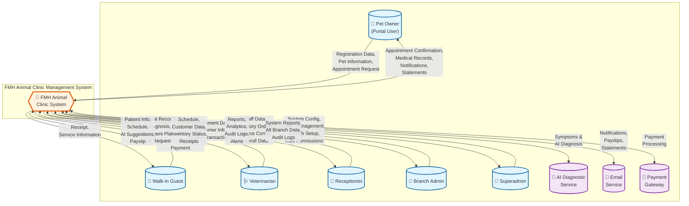

# Context Diagram (Level 0 DFD)
## FMH Animal Clinic System

---

## Overview

The Context Diagram (Level 0 DFD) shows the FMH Animal Clinic System as a single process with its external entities and data flows. This is the highest level view of the system.

---

## Mermaid Context Diagram



---

## PlantUML Context Diagram

```plantuml
@startuml FMH_Context_Diagram

!define ENTITY(name,icon) actor name as "icon name"
!define SYSTEM(name) rectangle name
!define EXTERNAL(name,icon) cloud name as "icon name"

skinparam actor {
    BackgroundColor #E1F5FE
    BorderColor #01579B
}

skinparam rectangle {
    BackgroundColor #FFF3E0
    BorderColor #E65100
    RoundCorner 20
}

skinparam cloud {
    BackgroundColor #F3E5F5
    BorderColor #7B1FA2
}

' External Entities - Users
ENTITY(PetOwner, "👤") <<Portal User>>
ENTITY(WalkIn, "👥") <<Walk-in Guest>>
ENTITY(Vet, "🩺") <<Veterinarian>>
ENTITY(Receptionist, "💼") <<Receptionist>>
ENTITY(BranchAdmin, "👔") <<Branch Admin>>
ENTITY(Superadmin, "🔐") <<Superadmin>>

' External Services
EXTERNAL(AI, "🤖") <<AI Diagnostic Service>>
EXTERNAL(Email, "📧") <<Email Service>>
EXTERNAL(Payment, "🏦") <<Payment Gateway>>

' Main System
SYSTEM("🏥 FMH Animal Clinic\nManagement System") as FMH

' Data Flows - Pet Owner
PetOwner --> FMH : Registration Data\nPet Info\nAppointment Request
FMH --> PetOwner : Confirmation\nMedical Records\nNotifications

' Data Flows - Walk-in
WalkIn --> FMH : Walk-in Request\nPayment
FMH --> WalkIn : Receipt\nService Info

' Data Flows - Veterinarian
Vet --> FMH : Medical Records\nDiagnosis\nAI Request
FMH --> Vet : Patient Info\nSchedule\nAI Suggestions\nPayslip

' Data Flows - Receptionist
Receptionist --> FMH : Appointments\nCustomer Info\nSales
FMH --> Receptionist : Schedule\nInventory\nReceipts

' Data Flows - Branch Admin
BranchAdmin --> FMH : Staff Data\nInventory\nPayroll
FMH --> BranchAdmin : Reports\nAnalytics\nAlerts

' Data Flows - Superadmin
Superadmin --> FMH : System Config\nUsers\nBranches\nRoles
FMH --> Superadmin : System Reports\nAudit Logs

' External Service Flows
FMH <--> AI : Symptoms\nDiagnosis
FMH --> Email : Notifications\nPayslips
FMH <--> Payment : Payment Processing

@enduml
```

---

## External Entities Description

### User Entities (Actors)

| Entity | Type | Description | Primary Data Flows |
|--------|------|-------------|-------------------|
| **Pet Owner** | Portal User | Registered pet owners who use the customer portal | IN: Registration, Pet info, Appointments<br/>OUT: Confirmations, Records, Notifications |
| **Walk-in Guest** | Guest | Unregistered visitors seeking services | IN: Walk-in requests, Payments<br/>OUT: Receipts, Service info |
| **Veterinarian** | Staff | Licensed veterinarians providing medical care | IN: Medical records, Diagnoses, AI requests<br/>OUT: Schedules, AI suggestions, Payslips |
| **Receptionist** | Staff | Front desk staff handling bookings & sales | IN: Appointments, Customer info, Sales<br/>OUT: Schedules, Inventory, Receipts |
| **Branch Admin** | Manager | Branch managers overseeing operations | IN: Staff data, Inventory, Payroll<br/>OUT: Reports, Analytics, Alerts |
| **Superadmin** | Admin | System administrators with full access | IN: System config, Users, Branches, Roles<br/>OUT: All data, System reports, Audit logs |

### External Service Entities

| Entity | Type | Description | Data Flows |
|--------|------|-------------|------------|
| **AI Diagnostic Service** | External API | AI-powered diagnostic suggestion engine | IN: Symptoms, History<br/>OUT: Diagnoses, Recommendations |
| **Email Service** | External API | Email delivery service (SMTP/API) | OUT: Notifications, Payslips, Statements |
| **Payment Gateway** | External API | E-payment processing (GCash, Maya, Cards) | IN/OUT: Payment transactions, Confirmations |

---

## Major Data Flows

### Inbound Data Flows (TO System)

| From | Data | Description |
|------|------|-------------|
| Pet Owner | Registration Data | Account creation with personal info |
| Pet Owner | Pet Information | Pet profiles, medical history |
| Pet Owner | Appointment Request | Booking requests with preferences |
| Walk-in Guest | Walk-in Request | Same-day service requests |
| All Users | Payment | Cash, card, or e-wallet payments |
| Veterinarian | Medical Records | Consultation notes, treatments, prescriptions |
| Veterinarian | AI Request | Request for AI diagnostic assistance |
| Receptionist | Sales Transactions | POS transactions, product sales |
| Branch Admin | Staff Data | Employee information, schedules |
| Branch Admin | Inventory Data | Stock adjustments, orders |
| Superadmin | System Config | Settings, permissions, branches |

### Outbound Data Flows (FROM System)

| To | Data | Description |
|----|------|-------------|
| Pet Owner | Appointment Confirmation | Booking confirmations with details |
| Pet Owner | Medical Records | Access to pet health history |
| Pet Owner | Notifications | Alerts, follow-ups, status updates |
| Pet Owner | Statements | Bills, payment history |
| All Users | Receipts | Transaction receipts |
| Veterinarian | Schedule | Work schedule, appointments |
| Veterinarian | AI Suggestions | AI-generated diagnostic recommendations |
| Veterinarian | Payslip | Monthly salary information |
| Branch Admin | Reports | Sales, inventory, performance reports |
| Branch Admin | Analytics | Dashboard metrics, trends |
| Superadmin | Audit Logs | System activity tracking |

---

## System Boundary

The FMH Animal Clinic Management System encompasses:

### Internal Functions
1. **Patient Management** - Pet registration, profiles, medical history
2. **Appointment System** - Scheduling, confirmations, follow-ups
3. **Medical Records** - Consultation records, treatments, prescriptions
4. **AI Diagnostics** - Integration with AI diagnostic engine
5. **Point of Sale** - Sales transactions, payments, receipts
6. **Inventory Management** - Stock tracking, transfers, alerts
7. **Employee Management** - Staff profiles, schedules, payroll
8. **Billing & Statements** - Customer accounts, statements
9. **Notifications** - Alerts, reminders, communications
10. **Reporting & Analytics** - Business intelligence, dashboards
11. **User & Access Control** - RBAC, authentication, authorization
12. **Multi-Branch Support** - Branch-specific data management

### External Integrations
- AI Diagnostic Service (API)
- Email Service (SMTP/API)
- Payment Gateway (GCash, Maya, Banks)

---

## Notes

1. **Multi-Branch**: System supports multiple clinic locations with branch-specific data isolation
2. **Dual Customer Model**: Supports both registered portal users and walk-in guests
3. **RBAC**: Role-Based Access Control with 6 hierarchy levels (0-10)
4. **Philippine Focus**: Integrated with local payment methods (GCash, Maya) and statutory compliance (SSS, PhilHealth, PAG-IBIG)
