# Data Flow Diagram (DFD) - Level 1
## FMH Animal Clinic System

---

## Overview

This Level 1 DFD decomposes the FMH Animal Clinic System into its major processes, showing data flows between processes, external entities, and data stores.

---

## Mermaid DFD Level 1

```mermaid
flowchart TB
    %% ═══════════════════════════════════════════════════════════════
    %% EXTERNAL ENTITIES
    %% ═══════════════════════════════════════════════════════════════
    
    PO(["👤 Pet Owner"])
    WI(["👥 Walk-in Guest"])
    VET(["🩺 Veterinarian"])
    REC(["💼 Receptionist"])
    BA(["👔 Branch Admin"])
    SA(["🔐 Superadmin"])
    AI_EXT(["🤖 AI Service"])
    EMAIL_EXT(["📧 Email Service"])
    
    %% ═══════════════════════════════════════════════════════════════
    %% PROCESSES
    %% ═══════════════════════════════════════════════════════════════
    
    P1((("1.0<br/>User &<br/>Access Mgmt")))
    P2((("2.0<br/>Patient<br/>Management")))
    P3((("3.0<br/>Appointment<br/>Management")))
    P4((("4.0<br/>Medical<br/>Records")))
    P5((("5.0<br/>AI<br/>Diagnostics")))
    P6((("6.0<br/>Point of<br/>Sale")))
    P7((("7.0<br/>Inventory<br/>Management")))
    P8((("8.0<br/>Employee<br/>Management")))
    P9((("9.0<br/>Payroll<br/>Processing")))
    P10((("10.0<br/>Notifications<br/>& Alerts")))
    P11((("11.0<br/>Reports &<br/>Analytics")))
    
    %% ═══════════════════════════════════════════════════════════════
    %% DATA STORES
    %% ═══════════════════════════════════════════════════════════════
    
    D1[("D1: Users")]
    D2[("D2: Roles &<br/>Permissions")]
    D3[("D3: Pets")]
    D4[("D4: Appointments")]
    D5[("D5: Medical<br/>Records")]
    D6[("D6: AI Diagnoses")]
    D7[("D7: Sales &<br/>Payments")]
    D8[("D8: Products &<br/>Inventory")]
    D9[("D9: Services")]
    D10[("D10: Employees")]
    D11[("D11: Payroll")]
    D12[("D12: Notifications")]
    D13[("D13: Branches")]
    D14[("D14: Activity<br/>Logs")]
    D15[("D15: Clinical<br/>Settings")]
    D16[("D16: CMS<br/>Content")]
    
    %% ═══════════════════════════════════════════════════════════════
    %% DATA FLOWS - User & Access Management
    %% ═══════════════════════════════════════════════════════════════
    
    PO -->|"Registration Data"| P1
    SA -->|"User/Role Config"| P1
    P1 -->|"Access Token"| PO
    P1 -->|"Access Token"| VET
    P1 -->|"Access Token"| REC
    P1 <-->|"User Data"| D1
    P1 <-->|"Role Data"| D2
    P1 -->|"Activity Log"| D14
    
    %% ═══════════════════════════════════════════════════════════════
    %% DATA FLOWS - Patient Management
    %% ═══════════════════════════════════════════════════════════════
    
    PO -->|"Pet Info"| P2
    REC -->|"Walk-in Pet Info"| P2
    P2 <-->|"Pet Records"| D3
    P2 -->|"Clinical Status Lookup"| D15
    P2 -->|"Pet Profile"| PO
    P2 -->|"Patient Data"| P4
    
    %% ═══════════════════════════════════════════════════════════════
    %% DATA FLOWS - Appointment Management
    %% ═══════════════════════════════════════════════════════════════
    
    PO -->|"Booking Request"| P3
    WI -->|"Walk-in Request"| P3
    REC -->|"Appointment Data"| P3
    P3 <-->|"Appointment Data"| D4
    P3 -->|"Reason Lookup"| D15
    P3 -->|"Pet Data"| D3
    P3 -->|"Schedule Check"| D10
    P3 -->|"Confirmation"| P10
    P3 -->|"Appointment Info"| VET
    P3 -->|"Appointment Info"| REC
    
    %% ═══════════════════════════════════════════════════════════════
    %% DATA FLOWS - Medical Records
    %% ═══════════════════════════════════════════════════════════════
    
    VET -->|"Consultation Notes"| P4
    P4 <-->|"Medical Records"| D5
    P4 -->|"Pet Status Update"| D3
    P4 -->|"Record Data"| PO
    P4 -->|"Clinical Data"| P5
    P4 -->|"Follow-up Alert"| P10
    
    %% ═══════════════════════════════════════════════════════════════
    %% DATA FLOWS - AI Diagnostics
    %% ═══════════════════════════════════════════════════════════════
    
    VET -->|"AI Request"| P5
    P5 <-->|"Symptoms/Diagnosis"| AI_EXT
    P5 <-->|"AI Results"| D6
    P5 -->|"AI Suggestions"| VET
    P5 -->|"Pet History"| D5
    
    %% ═══════════════════════════════════════════════════════════════
    %% DATA FLOWS - Point of Sale
    %% ═══════════════════════════════════════════════════════════════
    
    REC -->|"Sale Transaction"| P6
    PO -->|"Purchase Request"| P6
    WI -->|"Payment"| P6
    P6 <-->|"Sales Data"| D7
    P6 -->|"Stock Deduction"| D8
    P6 -->|"Service Lookup"| D9
    P6 -->|"Receipt"| PO
    P6 -->|"Receipt"| WI
    P6 -->|"Receipt"| REC
    
    %% ═══════════════════════════════════════════════════════════════
    %% DATA FLOWS - Inventory Management
    %% ═══════════════════════════════════════════════════════════════
    
    BA -->|"Stock Updates"| P7
    P7 <-->|"Inventory Data"| D8
    P7 -->|"Low Stock Alert"| P10
    P7 -->|"Stock Report"| BA
    P7 -->|"Branch Transfer"| D13
    
    %% ═══════════════════════════════════════════════════════════════
    %% DATA FLOWS - Employee Management
    %% ═══════════════════════════════════════════════════════════════
    
    BA -->|"Staff Data"| P8
    P8 <-->|"Employee Records"| D10
    P8 -->|"Schedule"| VET
    P8 -->|"Schedule"| REC
    P8 -->|"Employee Data"| P9
    P8 -->|"User Link"| D1
    
    %% ═══════════════════════════════════════════════════════════════
    %% DATA FLOWS - Payroll Processing
    %% ═══════════════════════════════════════════════════════════════
    
    BA -->|"Payroll Config"| P9
    P9 <-->|"Payslip Data"| D11
    P9 -->|"Employee Info"| D10
    P9 -->|"Payslip Email"| EMAIL_EXT
    P9 -->|"Payslip"| VET
    P9 -->|"Payroll Report"| BA
    P9 -->|"Audit Log"| D14
    
    %% ═══════════════════════════════════════════════════════════════
    %% DATA FLOWS - Notifications & Alerts
    %% ═══════════════════════════════════════════════════════════════
    
    P10 <-->|"Notifications"| D12
    P10 -->|"Email"| EMAIL_EXT
    P10 -->|"Alert"| PO
    P10 -->|"Alert"| VET
    P10 -->|"Alert"| BA
    
    %% ═══════════════════════════════════════════════════════════════
    %% DATA FLOWS - Reports & Analytics
    %% ═══════════════════════════════════════════════════════════════
    
    BA -->|"Report Request"| P11
    SA -->|"System Report Request"| P11
    SA -->|"CMS Content"| P11
    P11 -->|"Query"| D7
    P11 -->|"Query"| D8
    P11 -->|"Query"| D4
    P11 -->|"Query"| D11
    P11 <-->|"Content"| D16
    P11 <-->|"Settings"| D15
    P11 -->|"Reports"| BA
    P11 -->|"System Reports"| SA
    
    %% ═══════════════════════════════════════════════════════════════
    %% STYLING
    %% ═══════════════════════════════════════════════════════════════
    
    classDef entity fill:#e3f2fd,stroke:#1565c0,stroke-width:2px
    classDef process fill:#fff8e1,stroke:#ff8f00,stroke-width:2px
    classDef datastore fill:#e8f5e9,stroke:#2e7d32,stroke-width:2px
    
    class PO,WI,VET,REC,BA,SA,AI_EXT,EMAIL_EXT entity
    class P1,P2,P3,P4,P5,P6,P7,P8,P9,P10,P11 process
    class D1,D2,D3,D4,D5,D6,D7,D8,D9,D10,D11,D12,D13,D14 datastore
```

---

## Process Descriptions

### 1.0 User & Access Management
| Attribute | Description |
|-----------|-------------|
| **Purpose** | Handle user registration, authentication, and authorization |
| **Inputs** | Registration data, Login credentials, Role configurations |
| **Outputs** | Access tokens, User sessions, Activity logs |
| **Data Stores** | D1: Users, D2: Roles & Permissions, D14: Activity Logs |

### 2.0 Patient Management
| Attribute | Description |
|-----------|-------------|
| **Purpose** | Manage pet profiles and owner information |
| **Inputs** | Pet information from owners and receptionists |
| **Outputs** | Pet profiles, Patient data for medical records |
| **Data Stores** | D3: Pets |

### 3.0 Appointment Management
| Attribute | Description |
|-----------|-------------|
| **Purpose** | Handle appointment booking, scheduling, and status tracking |
| **Inputs** | Booking requests, Walk-in registrations, Schedule data |
| **Outputs** | Confirmations, Schedule info, Notifications |
| **Data Stores** | D4: Appointments |

### 4.0 Medical Records
| Attribute | Description |
|-----------|-------------|
| **Purpose** | Record and manage patient medical history and treatments |
| **Inputs** | Consultation notes, Diagnoses, Treatments, Prescriptions |
| **Outputs** | Medical history, Pet status updates, Follow-up alerts |
| **Data Stores** | D5: Medical Records |

### 5.0 AI Diagnostics
| Attribute | Description |
|-----------|-------------|
| **Purpose** | Integrate with AI service for diagnostic assistance |
| **Inputs** | Symptoms, Clinical signs, Medical history |
| **Outputs** | AI-generated diagnoses, Recommendations, Warning signs |
| **Data Stores** | D6: AI Diagnoses |

### 6.0 Point of Sale
| Attribute | Description |
|-----------|-------------|
| **Purpose** | Process sales transactions and payments |
| **Inputs** | Sale items (services/products), Payments |
| **Outputs** | Receipts, Transaction records, Inventory updates |
| **Data Stores** | D7: Sales & Payments, D8: Products, D9: Services |

### 7.0 Inventory Management
| Attribute | Description |
|-----------|-------------|
| **Purpose** | Track and manage product inventory across branches |
| **Inputs** | Stock adjustments, Transfers, Purchase orders |
| **Outputs** | Stock levels, Low stock alerts, Inventory reports |
| **Data Stores** | D8: Products & Inventory |

### 8.0 Employee Management
| Attribute | Description |
|-----------|-------------|
| **Purpose** | Manage staff profiles, schedules, and assignments |
| **Inputs** | Staff data, Schedules, Branch assignments |
| **Outputs** | Employee profiles, Work schedules |
| **Data Stores** | D10: Employees |

### 9.0 Payroll Processing
| Attribute | Description |
|-----------|-------------|
| **Purpose** | Calculate and process employee compensation |
| **Inputs** | Employee data, Attendance, Deductions, Allowances |
| **Outputs** | Payslips, Payroll reports, Email notifications |
| **Data Stores** | D11: Payroll |

### 10.0 Notifications & Alerts
| Attribute | Description |
|-----------|-------------|
| **Purpose** | Generate and deliver system notifications |
| **Inputs** | Events from other processes (appointments, stock, status) |
| **Outputs** | Push notifications, Email alerts, In-app messages |
| **Data Stores** | D12: Notifications |

### 11.0 Reports & Analytics
| Attribute | Description |
|-----------|-------------|
| **Purpose** | Generate business reports and analytics dashboards |
| **Inputs** | Query requests, Date ranges, Filters |
| **Outputs** | Sales reports, Inventory reports, Performance metrics |
| **Data Stores** | All relevant data stores (read-only) |

---

## Data Store Descriptions

| ID | Name | Description | Key Entities |
|----|------|-------------|--------------|
| D1 | Users | System user accounts | User, UserActivity |
| D2 | Roles & Permissions | RBAC configuration | Role, Module, ModulePermission |
| D3 | Pets | Patient (pet) records | Pet |
| D4 | Appointments | Booking and scheduling data | Appointment, FollowUp |
| D5 | Medical Records | Clinical records and history | MedicalRecord, RecordEntry |
| D6 | AI Diagnoses | AI-generated diagnostic data | AIDiagnosis |
| D7 | Sales & Payments | Transaction data | Sale, SaleItem, Payment, Refund, CashDrawer |
| D8 | Products & Inventory | Stock and product data | Product, StockAdjustment, Reservation, StockTransfer |
| D9 | Services | Service definitions | Service, CustomerStatement |
| D10 | Employees | Staff member profiles | StaffMember, VetSchedule, RecurringSchedule |
| D11 | Payroll | Compensation data | PayrollPeriod, Payslip, PayrollAuditLog |
| D12 | Notifications | Alert and notification records | Notification, FollowUp |
| D13 | Branches | Clinic location data | Branch |
| D14 | Activity Logs | Audit trail data | ActivityLog, UserActivity |
| D15 | Clinical Settings | Dynamic lookup tables | ClinicalStatus, ReasonForVisit |
| D16 | CMS Content | Landing page content management | SectionContent, HeroStat, CoreValue, LandingService, LandingVeterinarian |

---

## Data Flow Matrix

| Process | Inputs From | Outputs To | Data Stores R/W |
|---------|-------------|------------|-----------------|
| 1.0 User Mgmt | PO, SA | PO, VET, REC | D1 (R/W), D2 (R/W), D14 (W) |
| 2.0 Patient Mgmt | PO, REC | PO, P4 | D3 (R/W), D15 (R) |
| 3.0 Appointment | PO, WI, REC | VET, REC, P10 | D4 (R/W), D3 (R), D10 (R), D15 (R) |
| 4.0 Medical Records | VET | PO, P5, P10 | D5 (R/W), D3 (W) |
| 5.0 AI Diagnostics | VET, AI_EXT | VET | D6 (R/W), D5 (R) |
| 6.0 POS | REC, PO, WI | PO, WI, REC | D7 (R/W), D8 (W), D9 (R) |
| 7.0 Inventory | BA | BA, P10 | D8 (R/W), D13 (R) |
| 8.0 Employee Mgmt | BA | VET, REC, P9 | D10 (R/W), D1 (W) |
| 9.0 Payroll | BA | VET, BA, EMAIL | D11 (R/W), D10 (R), D14 (W) |
| 10.0 Notifications | P3, P4, P7 | PO, VET, BA, EMAIL | D12 (R/W) |
| 11.0 Reports | BA, SA | BA, SA | All (R), D15 (R/W), D16 (R/W) |

---

## Notes

1. **Branch Scoping**: Most data stores are implicitly scoped by Branch (D13)
2. **Audit Trail**: All processes log activities to D14 (Activity Logs)
3. **External Services**: GROQ AI Service (P5) and Email Service (P10) are external integrations
4. **Real-time Updates**: P10 (Notifications) receives events from multiple processes
5. **Dynamic Configuration**: D15 (Clinical Settings) provides admin-configurable lookup values for pet status and appointment reasons
6. **Content Management**: D16 (CMS Content) stores landing page content managed by admins
