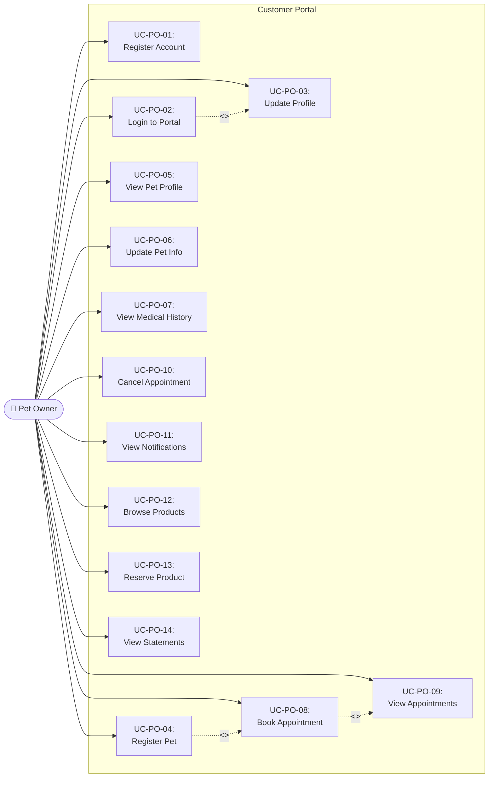
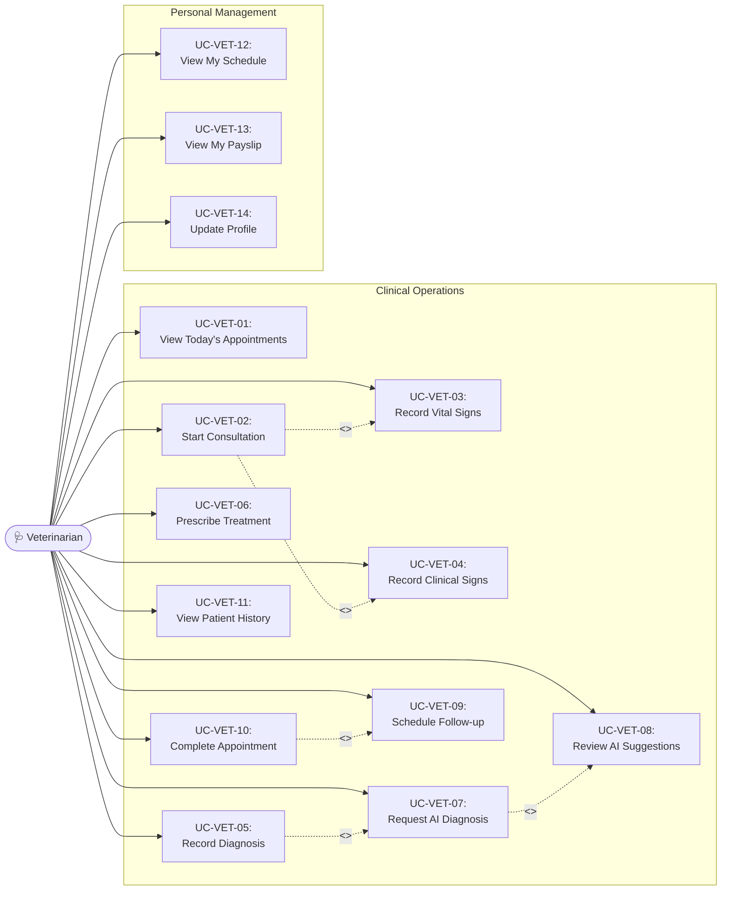
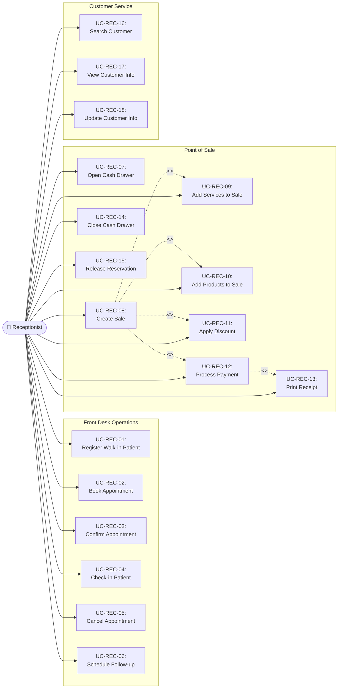
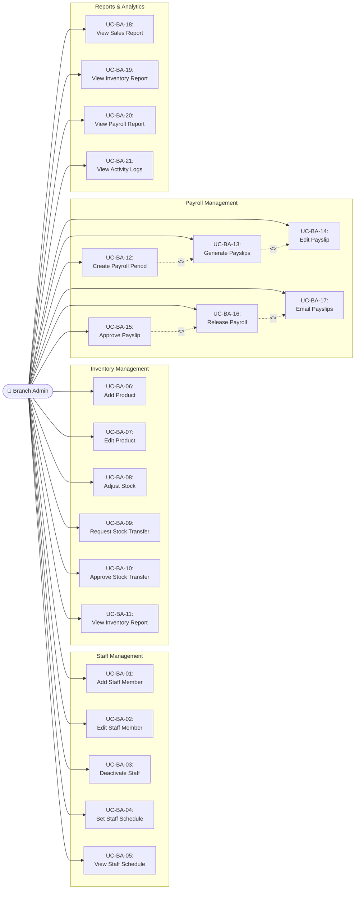
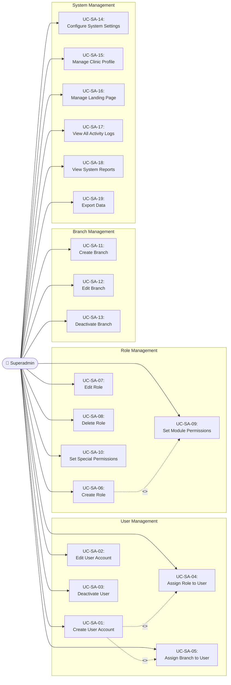

# Use Case Diagram (Updated)
## FMHSYNC SYSTEM

Based on the FMH Animal Clinic system analysis, here is the complete use case diagram matching your requirements.

---

## Complete Use Case Diagram

```mermaid
flowchart TB
    %% Actors
    CLIENT([Client User])
    VET([Veterinarian])
    AI([Artificial Intelligence])
    VETASST([Vet Assistant])
    RECEPT([Receptionist])
    ADMIN([Admin])
    
    %% System Boundary
    subgraph SYSTEM["FMHSYNC SYSTEM"]
        %% Client User Use Cases
        UC1[Book Appointment]
        UC1A[Select Branch]
        UC1B[Select Veterinarian]
        UC2[Automated Reminder]
        UC3[Generate Statement of Account]
        UC4[Manage Product/Reservation]
        UC4A[Search Product]
        UC4B[Check Stock]
        UC4C[Reserve Product]
        UC4D[View Reservation]
        UC4E[Cancel Reservation]
        UC5[View Medical Record]
        UC6[Generate Medical Record]
        UC7[Manage Medical Record]
        UC7A[Sign Medical Record]
        UC7B[Update Medical Record]
        
        %% Veterinarian Use Cases
        UC8[Diagnose Pet]
        UC8A[Generate AI Diagnostics]
        UC9[View Patient Record]
        UC9A[Update Patient Record]
        UC10[View Product and Medicines]
        UC11[Manage Veterinarian Schedule]
        UC12[Manage Appointment Schedule]
        UC12A[Emergency Override Slot]
        
        %% Receptionist Use Cases
        UC13[Manage Billing]
        UC14[Point of Sales]
        UC15[Manage Staff Schedule]
        UC16[Manage Inventory]
        UC17[Manage Client Record]
        
        %% Admin Use Cases
        UC18[Manage Users]
        UC19[Manage Products]
        UC20[Manage Reports]
        UC21[Manage System Settings]
    end
    
    %% Client User Connections
    CLIENT -->|1..*| UC1
    CLIENT --> UC2
    CLIENT --> UC3
    CLIENT --> UC4
    CLIENT --> UC5
    CLIENT --> UC6
    
    UC1 -.includes.-> UC1A
    UC1 -.includes.-> UC1B
    
    UC4 -.includes.-> UC4A
    UC4 -.includes.-> UC4B
    UC4 -.includes.-> UC4C
    UC4 -.includes.-> UC4D
    UC4 -.includes.-> UC4E
    
    %% Veterinarian Connections
    VET -->|1..*| UC8
    VET --> UC9
    VET --> UC10
    VET --> UC11
    VET --> UC12
    VET --> UC7
    
    UC8 -.includes.-> UC8A
    UC9 -.extends.-> UC9A
    UC7 -.extends.-> UC7A
    UC7 -.extends.-> UC7B
    UC12 -.includes.-> UC12A
    
    %% AI Integration
    UC8A --> AI
    UC8 --> AI
    
    %% Vet Assistant Connections
    VETASST --> UC7
    
    %% Receptionist Connections
    RECEPT -->|1..*| UC13
    RECEPT --> UC14
    RECEPT --> UC15
    RECEPT --> UC16
    RECEPT --> UC17
    
    %% Admin Connections
    ADMIN -->|1..*| UC18
    ADMIN --> UC19
    ADMIN --> UC20
    ADMIN --> UC21
```



---

## Actors and Use Cases Summary

### Client User
1. Book Appointment (includes: Select Branch, Select Veterinarian)
2. Automated Reminder
3. Generate Statement of Account
4. Manage Product/Reservation (includes: Search Product, Check Stock, Reserve Product, View Reservation, Cancel Reservation)
5. View Medical Record
6. Generate Medical Record

### Veterinarian
7. Diagnose Pet (includes: Generate AI Diagnostics) → uses AI
8. View Patient Record (extends: Update Patient Record)
9. View Product and Medicines
10. Manage Veterinarian Schedule
11. Manage Appointment Schedule (includes: Emergency Override Slot)
12. Manage Medical Record (extends: Sign Medical Record, Update Medical Record)

### Vet Assistant
13. Manage Medical Record (extends: Update Pet Records)

### Receptionist
14. Manage Billing
15. Point of Sales
16. Manage Staff Schedule
17. Manage Inventory
18. Manage Client Record

### Admin
19. Manage Users
20. Manage Products
21. Manage Reports
22. Manage System Settings

### External System
- **Artificial Intelligence**: Provides diagnostic assistance to veterinarians

---

## Additional Use Cases Based on System Analysis

### Client User (Additional)
- View Notifications
- Update Profile
- View Appointment History
- Cancel Appointment
- Request Follow-up Appointment

### Veterinarian (Additional)
- Record Consultation/Treatment
- Prescribe Medication
- Request Diagnostics
- Review AI Suggestions
- View Daily Appointments
 
### Vet Assistant (Additional)
- Assist in Consultation
- Prepare Treatment Room
- Manage Supplies
- View Appointment Queue

### Receptionist (Additional)
- Process Walk-in Appointments
- Process Payments
- Process Refunds
- Manage Cash Drawer
- Check-in Patients
- Generate Receipt

### Admin (Additional)
- Manage Branches
- Manage Roles & Permissions
- View Activity Logs
- Manage Payroll
- Manage Employee Records
- Manage Content Management System

---

## Complete Use Case Count

**Total Use Cases by Actor:**
- Client User: 11 use cases
- Veterinarian: 11 use cases  
- Vet Assistant: 5 use cases
- Receptionist: 11 use cases
- Admin: 10 use cases

**Key Relationships:**
- `<<includes>>`: Mandatory sub-use cases that are always executed
- `<<extends>>`: Optional extensions based on conditions
- External system integration with AI for diagnostic assistance

---

## Notes

- The diagram follows UML use case diagram conventions
- All actors interact with the system within the defined boundary
- The Artificial Intelligence system is an external actor that provides diagnostic support
- Branch-level access control applies based on RBAC system
- Activity logging captures all critical operations
- Walk-in customers can book appointments without registration
        
        subgraph UC_Appt["Appointment Management"]
            UC8["Book Appointment"]
            UC9["View Appointments"]
            UC10["Confirm Appointment"]
            UC11["Cancel Appointment"]
            UC12["Complete Appointment"]
            UC13["Schedule Follow-up"]
        end
        
        subgraph UC_Medical["Medical Records"]
            UC14["Create Medical Record"]
            UC15["Record Consultation"]
            UC16["Prescribe Treatment"]
            UC17["Request AI Diagnosis"]
            UC18["Review AI Diagnosis"]
        end
        
        subgraph UC_POS["Point of Sale"]
            UC19["Create Sale"]
            UC20["Add Sale Items"]
            UC21["Process Payment"]
            UC22["Print Receipt"]
            UC23["Void Sale"]
            UC24["Process Refund"]
            UC25["Manage Cash Drawer"]
        end
        
        subgraph UC_Inv["Inventory Management"]
            UC26["View Inventory"]
            UC27["Add Product"]
            UC28["Adjust Stock"]
            UC29["Request Transfer"]
            UC30["Approve Transfer"]
            UC31["Reserve Product"]
        end
        
        subgraph UC_Staff["Staff Management"]
            UC32["Manage Employees"]
            UC33["Set Schedule"]
            UC34["View Schedule"]
        end
        
        subgraph UC_Payroll["Payroll Management"]
            UC35["Generate Payroll"]
            UC36["Edit Payslip"]
            UC37["Release Payroll"]
            UC38["View Payslip"]
        end
        
        subgraph UC_Admin["System Administration"]
            UC39["Manage Users"]
            UC40["Manage Roles"]
            UC41["Manage Branches"]
            UC42["System Settings"]
            UC43["View Activity Logs"]
            UC44["View Reports"]
        end
    end
    
    %% Superadmin
    SA --> UC1
    SA --> UC39
    SA --> UC40
    SA --> UC41
    SA --> UC42
    SA --> UC43
    SA --> UC44
    
    %% Branch Admin
    BA --> UC1
    BA --> UC32
    BA --> UC33
    BA --> UC35
    BA --> UC36
    BA --> UC37
    BA --> UC27
    BA --> UC28
    BA --> UC30
    BA --> UC44
    
    %% Veterinarian
    VET --> UC1
    VET --> UC2
    VET --> UC34
    VET --> UC9
    VET --> UC12
    VET --> UC14
    VET --> UC15
    VET --> UC16
    VET --> UC17
    VET --> UC18
    VET --> UC38
    
    %% Vet Assistant
    VA --> UC1
    VA --> UC2
    VA --> UC34
    VA --> UC9
    VA --> UC5
    VA --> UC7
    
    %% Receptionist
    REC --> UC1
    REC --> UC2
    REC --> UC4
    REC --> UC6
    REC --> UC8
    REC --> UC10
    REC --> UC11
    REC --> UC13
    REC --> UC19
    REC --> UC20
    REC --> UC21
    REC --> UC22
    REC --> UC25
    REC --> UC26
    REC --> UC31
    
    %% Pet Owner
    PO --> UC1
    PO --> UC2
    PO --> UC3
    PO --> UC4
    PO --> UC5
    PO --> UC6
    PO --> UC7
    PO --> UC8
    PO --> UC9
    PO --> UC11
    PO --> UC26
    PO --> UC31
    
    %% Walk-in Guest
    WI --> UC8
```

---

## 2. Pet Owner Use Cases



### Pet Owner Use Case Specifications

| UC ID | Use Case | Description | Preconditions | Postconditions |
|-------|----------|-------------|---------------|----------------|
| UC-PO-01 | Register Account | Create new pet owner account | None | Account created, can login |
| UC-PO-02 | Login to Portal | Authenticate to access portal | Has account | Session created |
| UC-PO-03 | Update Profile | Edit personal information | Logged in | Profile updated |
| UC-PO-04 | Register Pet | Add new pet to account | Logged in | Pet profile created |
| UC-PO-05 | View Pet Profile | See pet details | Logged in, has pet | Profile displayed |
| UC-PO-06 | Update Pet Info | Edit pet information | Logged in, has pet | Pet info updated |
| UC-PO-07 | View Medical History | See pet's medical records | Logged in, has pet | Records displayed |
| UC-PO-08 | Book Appointment | Schedule a clinic visit | Logged in, has pet | Appointment created |
| UC-PO-09 | View Appointments | See appointment schedule | Logged in | Appointments listed |
| UC-PO-10 | Cancel Appointment | Cancel scheduled appointment | Has pending appointment | Appointment cancelled |
| UC-PO-11 | View Notifications | See alerts and messages | Logged in | Notifications displayed |
| UC-PO-12 | Browse Products | View available products | Logged in | Products displayed |
| UC-PO-13 | Reserve Product | Reserve product for pickup | Logged in, product available | Reservation created |
| UC-PO-14 | View Statements | See billing statements | Logged in | Statements displayed |

---

## 3. Veterinarian Use Cases



### Veterinarian Use Case Specifications

| UC ID | Use Case | Description | Preconditions | Postconditions |
|-------|----------|-------------|---------------|----------------|
| UC-VET-01 | View Today's Appointments | See scheduled patients | Logged in | Appointments displayed |
| UC-VET-02 | Start Consultation | Begin patient examination | Appointment confirmed | Record created |
| UC-VET-03 | Record Vital Signs | Log weight, temperature | In consultation | Vitals saved |
| UC-VET-04 | Record Clinical Signs | Document symptoms | In consultation | Signs recorded |
| UC-VET-05 | Record Diagnosis | Enter diagnosis | In consultation | Diagnosis saved |
| UC-VET-06 | Prescribe Treatment | Enter Tx and Rx | In consultation | Prescription saved |
| UC-VET-07 | Request AI Diagnosis | Submit to AI service | Has clinical data | AI request sent |
| UC-VET-08 | Review AI Suggestions | Evaluate AI recommendations | AI response received | Review recorded |
| UC-VET-09 | Schedule Follow-up | Set return visit date | Consultation complete | Follow-up scheduled |
| UC-VET-10 | Complete Appointment | Finalize consultation | All data entered | Status = COMPLETED |
| UC-VET-11 | View Patient History | See pet's past records | Patient selected | History displayed |
| UC-VET-12 | View My Schedule | See work schedule | Logged in | Schedule displayed |
| UC-VET-13 | View My Payslip | See salary details | Released payslip exists | Payslip displayed |

---

## 4. Receptionist Use Cases



---

## 5. Branch Admin Use Cases



---

## 6. Superadmin Use Cases



---

## PlantUML - Complete Use Case Diagram

```plantuml
@startuml FMH_UseCase_Complete

left to right direction
skinparam packageStyle rectangle
skinparam actorStyle awesome

' Actors
actor "Pet Owner" as PO #LightBlue
actor "Walk-in Guest" as WI #LightGray
actor "Receptionist" as REC #LightGreen
actor "Veterinarian" as VET #LightYellow
actor "Vet Assistant" as VA #LightYellow
actor "Branch Admin" as BA #Orange
actor "Superadmin" as SA #Red

' External Systems
actor "AI Service" as AI #Purple
actor "Email Service" as EMAIL #Pink

rectangle "FMH Animal Clinic System" {
    
    package "Authentication" {
        usecase "Login" as UC_Login
        usecase "Logout" as UC_Logout
        usecase "Reset Password" as UC_Reset
    }
    
    package "Patient Management" {
        usecase "Register Pet" as UC_RegPet
        usecase "View Pet Profile" as UC_ViewPet
        usecase "Update Pet Info" as UC_UpdatePet
        usecase "View Medical History" as UC_ViewHistory
    }
    
    package "Appointment Management" {
        usecase "Book Appointment" as UC_Book
        usecase "Confirm Appointment" as UC_Confirm
        usecase "Cancel Appointment" as UC_Cancel
        usecase "Complete Appointment" as UC_Complete
        usecase "Schedule Follow-up" as UC_Followup
    }
    
    package "Medical Records" {
        usecase "Create Medical Record" as UC_CreateRec
        usecase "Record Consultation" as UC_Consult
        usecase "Prescribe Treatment" as UC_Prescribe
        usecase "Request AI Diagnosis" as UC_AIReq
        usecase "Review AI Diagnosis" as UC_AIReview
    }
    
    package "Point of Sale" {
        usecase "Create Sale" as UC_Sale
        usecase "Process Payment" as UC_Pay
        usecase "Print Receipt" as UC_Receipt
        usecase "Void Sale" as UC_Void
        usecase "Process Refund" as UC_Refund
        usecase "Manage Cash Drawer" as UC_Drawer
    }
    
    package "Inventory" {
        usecase "View Inventory" as UC_ViewInv
        usecase "Add Product" as UC_AddProd
        usecase "Adjust Stock" as UC_AdjStock
        usecase "Request Transfer" as UC_ReqTrans
        usecase "Approve Transfer" as UC_AppTrans
    }
    
    package "Staff Management" {
        usecase "Manage Employees" as UC_MgEmp
        usecase "Set Schedule" as UC_SetSched
        usecase "View Schedule" as UC_ViewSched
    }
    
    package "Payroll" {
        usecase "Generate Payroll" as UC_GenPay
        usecase "Edit Payslip" as UC_EditSlip
        usecase "Release Payroll" as UC_RelPay
        usecase "View Payslip" as UC_ViewSlip
    }
    
    package "Administration" {
        usecase "Manage Users" as UC_MgUsers
        usecase "Manage Roles" as UC_MgRoles
        usecase "Manage Branches" as UC_MgBranch
        usecase "System Settings" as UC_Settings
        usecase "View Activity Logs" as UC_Logs
        usecase "View Reports" as UC_Reports
    }
}

' Relationships - Pet Owner
PO --> UC_Login
PO --> UC_RegPet
PO --> UC_ViewPet
PO --> UC_UpdatePet
PO --> UC_ViewHistory
PO --> UC_Book
PO --> UC_Cancel
PO --> UC_ViewInv

' Relationships - Walk-in
WI --> UC_Book

' Relationships - Receptionist
REC --> UC_Login
REC --> UC_RegPet
REC --> UC_Book
REC --> UC_Confirm
REC --> UC_Cancel
REC --> UC_Followup
REC --> UC_Sale
REC --> UC_Pay
REC --> UC_Receipt
REC --> UC_Drawer
REC --> UC_ViewInv

' Relationships - Veterinarian
VET --> UC_Login
VET --> UC_ViewSched
VET --> UC_Complete
VET --> UC_CreateRec
VET --> UC_Consult
VET --> UC_Prescribe
VET --> UC_AIReq
VET --> UC_AIReview
VET --> UC_Followup
VET --> UC_ViewSlip

' Relationships - Vet Assistant
VA --> UC_Login
VA --> UC_ViewSched
VA --> UC_ViewPet
VA --> UC_ViewHistory

' Relationships - Branch Admin
BA --> UC_Login
BA --> UC_MgEmp
BA --> UC_SetSched
BA --> UC_AddProd
BA --> UC_AdjStock
BA --> UC_AppTrans
BA --> UC_GenPay
BA --> UC_EditSlip
BA --> UC_RelPay
BA --> UC_Reports
BA --> UC_Logs

' Relationships - Superadmin
SA --> UC_Login
SA --> UC_MgUsers
SA --> UC_MgRoles
SA --> UC_MgBranch
SA --> UC_Settings
SA --> UC_Logs
SA --> UC_Reports

' External Services
UC_AIReq --> AI : <<uses>>
UC_RelPay --> EMAIL : <<uses>>

' Include/Extend
UC_Sale ..> UC_Pay : <<include>>
UC_Pay ..> UC_Receipt : <<include>>
UC_AIReq ..> UC_AIReview : <<include>>
UC_Complete ..> UC_Followup : <<extend>>
UC_GenPay ..> UC_EditSlip : <<extend>>

@enduml
```



---

## Actor-Use Case Summary Matrix

| Use Case | Pet Owner | Walk-in | Receptionist | Veterinarian | Vet Assistant | Branch Admin | Superadmin |
|----------|:---------:|:-------:|:------------:|:------------:|:-------------:|:------------:|:----------:|
| Login/Logout | ✓ | | ✓ | ✓ | ✓ | ✓ | ✓ |
| Register Pet | ✓ | | ✓ | | | | |
| View Pet Profile | ✓ | | ✓ | ✓ | ✓ | | |
| Book Appointment | ✓ | ✓ | ✓ | | | | |
| Confirm Appointment | | | ✓ | | | | |
| Cancel Appointment | ✓ | | ✓ | | | | |
| Complete Appointment | | | | ✓ | | | |
| Create Medical Record | | | | ✓ | | | |
| Request AI Diagnosis | | | | ✓ | | | |
| Create Sale | | | ✓ | | | | |
| Process Payment | | | ✓ | | | | |
| View Inventory | ✓ | | ✓ | | | ✓ | |
| Adjust Stock | | | | | | ✓ | |
| Manage Employees | | | | | | ✓ | |
| Generate Payroll | | | | | | ✓ | |
| View Payslip | | | | ✓ | ✓ | | |
| Manage Users | | | | | | | ✓ |
| Manage Roles | | | | | | | ✓ |
| System Settings | | | | | | | ✓ |
