# Use Case Diagram (Simplified Version)
## FMHSYNC SYSTEM

Based on the FMH Animal Clinic system analysis, here is the complete use case diagram matching your requirements.

---

## Complete Use Case Diagram

```mermaid
flowchart TB
    %% Actors
    CLIENT([Client User])
    VET([Veterinarian])
    AI([Artificial Intelligence])
    VETASST([Vet Assistant])
    RECEPT([Receptionist])
    ADMIN([Admin])
    
    %% System Boundary
    subgraph SYSTEM["FMHSYNC SYSTEM"]
        %% Client User Use Cases
        UC1[Book Appointment]
        UC1A[Select Branch]
        UC1B[Select Veterinarian]
        UC2[Automated Reminder]
        UC3[Generate Statement of Account]
        UC4[Manage Product/Reservation]
        UC4A[Search Product]
        UC4B[Check Stock]
        UC4C[Reserve Product]
        UC4D[View Reservation]
        UC4E[Cancel Reservation]
        UC5[View Medical Record]
        UC6[Generate Medical Record]
        UC7[Manage Medical Record]
        UC7A[Sign Medical Record]
        UC7B[Update Medical Record]
        
        %% Veterinarian Use Cases
        UC8[Diagnose Pet]
        UC8A[Generate AI Diagnostics]
        UC9[View Patient Record]
        UC9A[Update Patient Record]
        UC10[View Product and Medicines]
        UC11[Manage Veterinarian Schedule]
        UC12[Manage Appointment Schedule]
        UC12A[Emergency Override Slot]
        
        %% Receptionist Use Cases
        UC13[Manage Billing]
        UC14[Point of Sales]
        UC15[Manage Staff Schedule]
        UC16[Manage Inventory]
        UC17[Manage Client Record]
        
        %% Admin Use Cases
        UC18[Manage Users]
        UC19[Manage Products]
        UC20[Manage Reports]
        UC21[Manage System Settings]
    end
    
    %% Client User Connections
    CLIENT -->|1..*| UC1
    CLIENT --> UC2
    CLIENT --> UC3
    CLIENT --> UC4
    CLIENT --> UC5
    CLIENT --> UC6
    
    UC1 -.includes.-> UC1A
    UC1 -.includes.-> UC1B
    
    UC4 -.includes.-> UC4A
    UC4 -.includes.-> UC4B
    UC4 -.includes.-> UC4C
    UC4 -.includes.-> UC4D
    UC4 -.includes.-> UC4E
    
    %% Veterinarian Connections
    VET -->|1..*| UC8
    VET --> UC9
    VET --> UC10
    VET --> UC11
    VET --> UC12
    VET --> UC7
    
    UC8 -.includes.-> UC8A
    UC9 -.extends.-> UC9A
    UC7 -.extends.-> UC7A
    UC7 -.extends.-> UC7B
    UC12 -.includes.-> UC12A
    
    %% AI Integration
    UC8A --> AI
    UC8 --> AI
    
    %% Vet Assistant Connections
    VETASST --> UC7
    
    %% Receptionist Connections
    RECEPT -->|1..*| UC13
    RECEPT --> UC14
    RECEPT --> UC15
    RECEPT --> UC16
    RECEPT --> UC17
    
    %% Admin Connections
    ADMIN -->|1..*| UC18
    ADMIN --> UC19
    ADMIN --> UC20
    ADMIN --> UC21
```

---

## Actors and Use Cases Summary

### Client User
1. Book Appointment (includes: Select Branch, Select Veterinarian)
2. Automated Reminder
3. Generate Statement of Account
4. Manage Product/Reservation (includes: Search Product, Check Stock, Reserve Product, View Reservation, Cancel Reservation)
5. View Medical Record
6. Generate Medical Record

### Veterinarian
7. Diagnose Pet (includes: Generate AI Diagnostics) → uses AI
8. View Patient Record (extends: Update Patient Record)
9. View Product and Medicines
10. Manage Veterinarian Schedule
11. Manage Appointment Schedule (includes: Emergency Override Slot)
12. Manage Medical Record (extends: Sign Medical Record, Update Medical Record)

### Vet Assistant
13. Manage Medical Record (extends: Update Pet Records)

### Receptionist
14. Manage Billing
15. Point of Sales
16. Manage Staff Schedule
17. Manage Inventory
18. Manage Client Record

### Admin
19. Manage Users
20. Manage Products
21. Manage Reports
22. Manage System Settings

### External System
- **Artificial Intelligence**: Provides diagnostic assistance to veterinarians

---

## Additional Use Cases Not in Original Diagram (Based on System Analysis)

### Client User (Missing from diagram)
- View Notifications
- Update Profile
- View Appointment History
- Cancel Appointment
- Request Follow-up Appointment

### Veterinarian (Missing from diagram)
- Record Consultation/Treatment
- Prescribe Medication
- Request Diagnostics
- Review AI Suggestions
- View Daily Appointments

### Vet Assistant (Missing from diagram)
- Assist in Consultation
- Prepare Treatment Room
- Manage Supplies
- View Appointment Queue

### Receptionist (Missing from diagram)
- Process Walk-in Appointments
- Process Payments
- Process Refunds
- Manage Cash Drawer
- Check-in Patients
- Generate Receipt

### Admin (Missing from diagram)
- Manage Branches
- Manage Roles & Permissions
- View Activity Logs
- Manage Payroll
- Manage Employee Records
- Manage Content Management System

---

## Complete Enhanced Use Case List

If you want to add the missing use cases to make the diagram comprehensive, here's what should be included:

**Total Use Cases by Actor:**
- Client User: 11 use cases
- Veterinarian: 11 use cases
- Vet Assistant: 5 use cases
- Receptionist: 11 use cases
- Admin: 10 use cases

**Key Relationships:**
- `<<includes>>`: Mandatory sub-use cases that are always executed
- `<<extends>>`: Optional extensions based on conditions
- External system integration with AI for diagnostic assistance

---

## Notes

- The diagram follows UML use case diagram conventions
- All actors interact with the system within the defined boundary
- The Artificial Intelligence system is an external actor that provides diagnostic support
- Branch-level access control applies based on RBAC system
- Activity logging captures all critical operations
