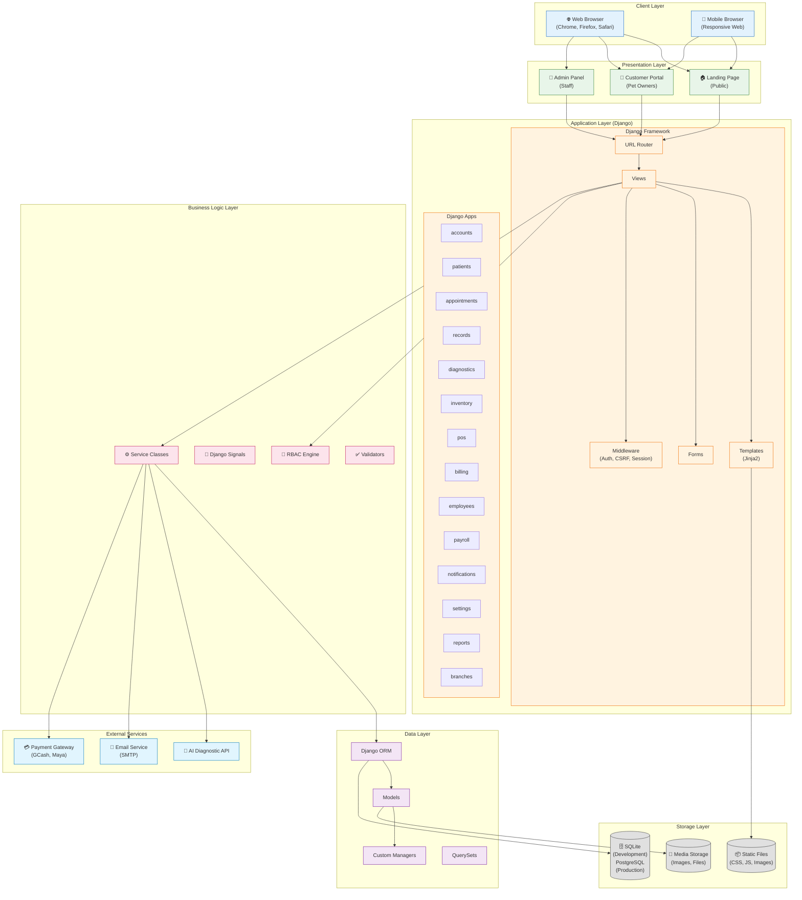
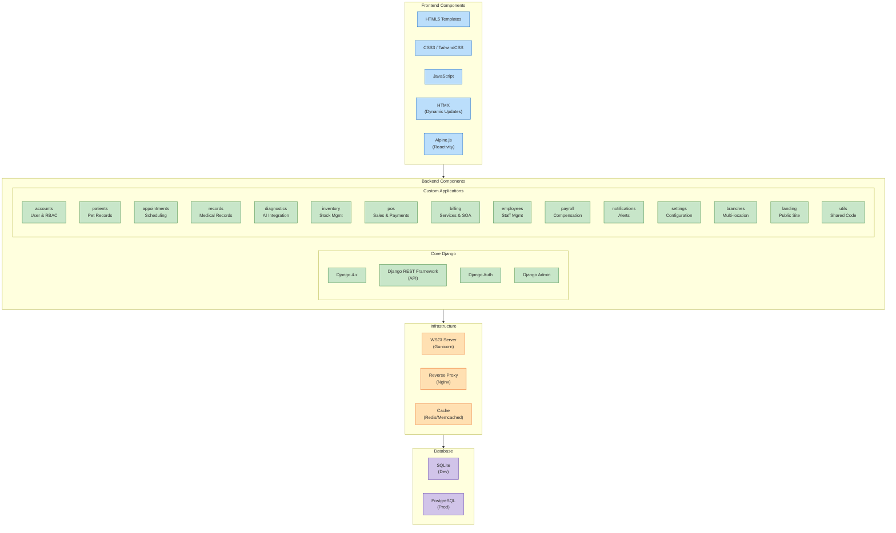
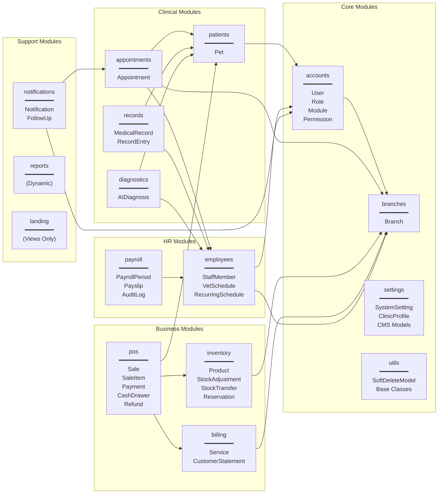
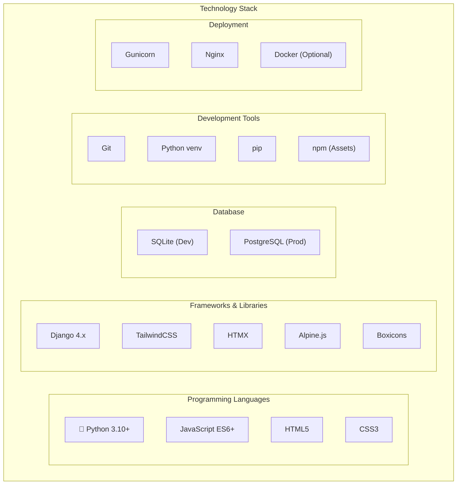
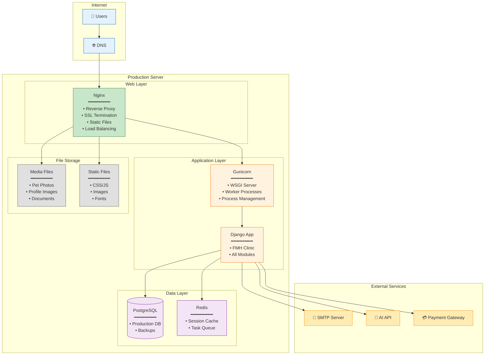
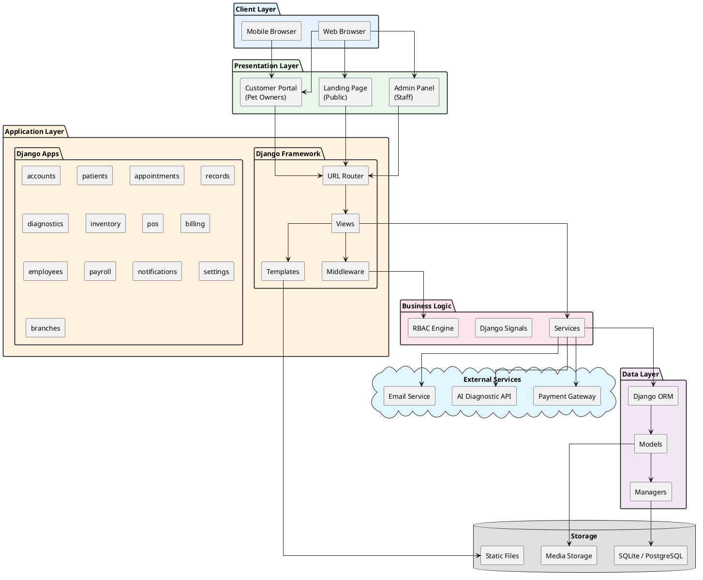

# System Architecture Diagram
## FMH Animal Clinic System

---

## Overview

This document describes the technical architecture of the FMH Animal Clinic Management System, a Django-based web application with multi-branch support.

---

## 1. High-Level Architecture



---

## 2. Component Architecture



---

## 3. Module Architecture (Django Apps)



---

## 4. Technology Stack



---

## 5. Deployment Architecture



---

## 6. Security Architecture

```mermaid
flowchart TB
    subgraph Security["Security Layers"]
        subgraph Network["Network Security"]
            SSL["🔒 SSL/TLS<br/>HTTPS Only"]
            FIREWALL["🛡️ Firewall<br/>Port Restrictions"]
        end
        
        subgraph Application["Application Security"]
            CSRF["CSRF Protection<br/>(Django Built-in)"]
            XSS["XSS Prevention<br/>(Template Escaping)"]
            SQL_INJ["SQL Injection<br/>(ORM Protection)"]
            CORS["CORS Policy"]
        end
        
        subgraph Auth["Authentication & Authorization"]
            SESSION["Session Auth<br/>(Django Sessions)"]
            RBAC_SEC["RBAC Engine<br/>(Custom Roles)"]
            PERM["Permission Checks<br/>(Decorators)"]
        end
        
        subgraph Data["Data Security"]
            PWD_HASH["Password Hashing<br/>(PBKDF2)"]
            SENSITIVE["Sensitive Data<br/>Encryption"]
            AUDIT["Audit Logging"]
        end
    end
    
    Network --> Application
    Application --> Auth
    Auth --> Data
```



---

## 7. PlantUML - System Architecture



---

## 8. Technology Stack Summary

| Layer | Technology | Version | Purpose |
|-------|------------|---------|---------|
| **Language** | Python | 3.10+ | Backend development |
| **Framework** | Django | 4.x | Web framework |
| **Database** | SQLite/PostgreSQL | - | Data storage |
| **Frontend** | HTML5, CSS3, JS | - | User interface |
| **CSS Framework** | TailwindCSS | 3.x | Styling |
| **Dynamic UI** | HTMX | 1.x | AJAX without JS |
| **Reactivity** | Alpine.js | 3.x | Lightweight reactivity |
| **Icons** | Boxicons | 2.x | Icon library |
| **WSGI** | Gunicorn | - | Production server |
| **Proxy** | Nginx | - | Reverse proxy, SSL |
| **Cache** | Redis | - | Session cache, queues |

---

## 9. Directory Structure

```
FMHANIMALCLINIC/
├── FMHANIMALCLINIC/          # Django project settings
│   ├── settings.py           # Configuration
│   ├── urls.py               # Root URL patterns
│   └── wsgi.py               # WSGI config
│
├── accounts/                  # User & RBAC
├── appointments/              # Scheduling
├── billing/                   # Services & SOA
├── branches/                  # Multi-location
├── diagnostics/               # AI integration
├── employees/                 # Staff management
├── inventory/                 # Stock management
├── landing/                   # Public website
├── notifications/             # Alerts
├── patients/                  # Pet records
├── payroll/                   # Compensation
├── pos/                       # Point of sale
├── records/                   # Medical records
├── reports/                   # Analytics
├── settings/                  # System config
├── utils/                     # Shared utilities
│
├── static/                    # Static files
│   ├── css/
│   ├── js/
│   └── image/
│
├── templates/                 # HTML templates
│   ├── base.html
│   ├── landing/
│   ├── portal/
│   └── admin/
│
├── media/                     # User uploads
│   ├── pet_photos/
│   └── profiles/
│
├── manage.py                  # Django CLI
├── requirements.txt           # Dependencies
└── .env                       # Environment variables
```

---

## 10. Key Architectural Decisions

| Decision | Rationale |
|----------|-----------|
| **Django Monolith** | Simpler deployment, shared ORM, integrated auth |
| **HTMX over React** | Less complexity, server-rendered, progressive enhancement |
| **Custom RBAC** | Fine-grained permissions beyond Django groups |
| **Soft Delete** | Preserve audit trail, allow data recovery |
| **Multi-Branch Design** | Branch-scoped data, independent operations |
| **Signal-Based Events** | Loose coupling, automatic sync (e.g., pet status updates) |
| **SQLite for Dev** | Zero-config development, easy reset |
| **PostgreSQL for Prod** | Robust, scalable, ACID compliance |
