# HIPO Charts (Hierarchy plus Input-Process-Output)
## FMH Animal Clinic System

---

## Overview

HIPO (Hierarchy plus Input-Process-Output) charts document the system's modular structure and the data transformations within each module.

---

## 1. System Hierarchy Chart

```mermaid
flowchart TB
    ROOT["FMH Animal Clinic<br/>Management System"]
    
    ROOT --> M1["1.0 User &<br/>Access Management"]
    ROOT --> M2["2.0 Patient<br/>Management"]
    ROOT --> M3["3.0 Appointment<br/>Management"]
    ROOT --> M4["4.0 Medical Records<br/>Management"]
    ROOT --> M5["5.0 AI Diagnostics"]
    ROOT --> M6["6.0 Point of Sale"]
    ROOT --> M7["7.0 Inventory<br/>Management"]
    ROOT --> M8["8.0 Employee<br/>Management"]
    ROOT --> M9["9.0 Payroll<br/>Management"]
    ROOT --> M10["10.0 Notifications"]
    ROOT --> M11["11.0 Reports &<br/>Analytics"]
    ROOT --> M12["12.0 System<br/>Administration"]
    
    M1 --> M1_1["1.1 User Registration"]
    M1 --> M1_2["1.2 Authentication"]
    M1 --> M1_3["1.3 Role Management"]
    M1 --> M1_4["1.4 Permission Control"]
    
    M2 --> M2_1["2.1 Pet Registration"]
    M2 --> M2_2["2.2 Pet Profile Mgmt"]
    M2 --> M2_3["2.3 Owner Management"]
    
    M3 --> M3_1["3.1 Appointment Booking"]
    M3 --> M3_2["3.2 Schedule Management"]
    M3 --> M3_3["3.3 Follow-up Scheduling"]
    
    M4 --> M4_1["4.1 Record Creation"]
    M4 --> M4_2["4.2 Consultation Entry"]
    M4 --> M4_3["4.3 Treatment Recording"]
    
    M5 --> M5_1["5.1 AI Request"]
    M5 --> M5_2["5.2 Diagnosis Review"]
    
    M6 --> M6_1["6.1 Sales Transaction"]
    M6 --> M6_2["6.2 Payment Processing"]
    M6 --> M6_3["6.3 Cash Drawer Mgmt"]
    M6 --> M6_4["6.4 Refund Processing"]
    
    M7 --> M7_1["7.1 Product Management"]
    M7 --> M7_2["7.2 Stock Adjustment"]
    M7 --> M7_3["7.3 Stock Transfer"]
    M7 --> M7_4["7.4 Reservation Mgmt"]
    
    M8 --> M8_1["8.1 Staff Management"]
    M8 --> M8_2["8.2 Schedule Management"]
    M8 --> M8_3["8.3 License Tracking"]
    
    M9 --> M9_1["9.1 Payroll Generation"]
    M9 --> M9_2["9.2 Payslip Management"]
    M9 --> M9_3["9.3 Payroll Release"]
    
    M10 --> M10_1["10.1 Notification Generation"]
    M10 --> M10_2["10.2 Email Delivery"]
    
    M11 --> M11_1["11.1 Sales Reports"]
    M11 --> M11_2["11.2 Inventory Reports"]
    M11 --> M11_3["11.3 Payroll Reports"]
    
    M12 --> M12_1["12.1 Branch Management"]
    M12 --> M12_2["12.2 System Settings"]
    M12 --> M12_3["12.3 Content Management"]
    M12 --> M12_4["12.4 Clinical Status Mgmt"]
    M12 --> M12_5["12.5 Reason for Visit Mgmt"]
```

---

## 2. IPO Charts by Module

### 2.1 User & Access Management (Module 1.0)

#### 1.1 User Registration

| Input | Process | Output |
|-------|---------|--------|
| Registration form data (username, email, password, phone, address) | 1. Validate form data 2. Check username/email uniqueness 3. Hash password 4. Create User record 5. Assign default role 6. Log activity | User account created Confirmation message Activity log entry |

#### 1.2 Authentication

| Input | Process | Output |
|-------|---------|--------|
| Login credentials (username, password) | 1. Validate credentials 2. Check user active status 3. Verify password hash 4. Create session 5. Log login activity | Session token User dashboard redirect Login activity log |

#### 1.3 Role Management

| Input | Process | Output |
|-------|---------|--------|
| Role definition (name, code, hierarchy, permissions) | 1. Validate role data 2. Create/Update Role record 3. Set module permissions 4. Set special permissions 5. Log changes | Role record Permission mappings Audit log |

#### 1.4 Permission Control

| Input | Process | Output |
|-------|---------|--------|
| User request, Required permission | 1. Get user's role 2. Check hierarchy level 3. Query module permissions 4. Evaluate branch restrictions 5. Return access decision | Access granted/denied Filtered data (if branch-restricted) |

---

### 2.2 Patient Management (Module 2.0)

#### 2.1 Pet Registration

| Input | Process | Output |
|-------|---------|--------|
| Pet data (name, species, breed, DOB, sex, photo) Owner info (if walk-in) | 1. Validate pet data 2. Upload photo (if provided) 3. Create Pet record 4. Link to owner (or set guest info) 5. Set initial status to HEALTHY 6. Log activity | Pet profile created Confirmation to owner Activity log |

#### 2.2 Pet Profile Management

| Input | Process | Output |
|-------|---------|--------|
| Updated pet info Pet ID | 1. Retrieve Pet record 2. Validate updates 3. Update Pet fields 4. Sync to appointments (signal) 5. Log changes | Updated Pet profile Synced appointment data Activity log |

---

### 2.3 Appointment Management (Module 3.0)

#### 3.1 Appointment Booking

| Input | Process | Output |
|-------|---------|--------|
| Booking request (date, time, branch, vet preference, reason) Pet/Owner info | 1. Validate date/time availability 2. Check vet schedule 3. Create Appointment record 4. Denormalize pet/owner data 5. Set status = PENDING 6. Generate notification | Appointment record Confirmation message Notification to staff |

#### 3.2 Schedule Management

| Input | Process | Output |
|-------|---------|--------|
| Status update (CONFIRM, CANCEL, COMPLETE) Appointment ID | 1. Retrieve Appointment 2. Validate status transition 3. Update status 4. Link to Sale (if COMPLETE) 5. Generate notification | Updated appointment Notification to owner POS linkage (if completed) |

#### 3.3 Follow-up Scheduling

| Input | Process | Output |
|-------|---------|--------|
| Follow-up date(s) Reason Appointment ID | 1. Validate dates 2. Create FollowUp record 3. Link to appointment 4. Generate notification | FollowUp record Owner notification Staff reminder |

---

### 2.4 Medical Records Management (Module 4.0)

#### 4.1 Record Creation

| Input | Process | Output |
|-------|---------|--------|
| Pet ID Vet ID Branch ID | 1. Retrieve Pet 2. Check for existing active record 3. Create MedicalRecord 4. Set date_recorded | MedicalRecord created Ready for entries |

#### 4.2 Consultation Entry

| Input | Process | Output |
|-------|---------|--------|
| Vital signs (weight, temperature) Clinical signs Treatment (Tx) Prescription (Rx) Follow-up date Action required | 1. Validate entry data 2. Create RecordEntry 3. Link to MedicalRecord 4. Update Pet.status (via signal) 5. Notify owner (if status changed) | RecordEntry created Pet status updated Owner notification |

---

### 2.5 AI Diagnostics (Module 5.0)

#### 5.1 AI Request

| Input | Process | Output |
|-------|---------|--------|
| Symptoms Medical history Pet ID Requesting Vet ID | 1. Compile input data 2. Send to AI API 3. Parse AI response 4. Create AIDiagnosis record 5. Store differential diagnoses | AIDiagnosis record Primary diagnosis Recommended tests Warning signs |

#### 5.2 Diagnosis Review

| Input | Process | Output |
|-------|---------|--------|
| AIDiagnosis ID Review notes Reviewing Vet ID | 1. Retrieve AIDiagnosis 2. Update review fields 3. Set is_reviewed = True 4. Record reviewed_at timestamp | Reviewed AIDiagnosis Audit trail |

---

### 2.6 Point of Sale (Module 6.0)

#### 6.1 Sales Transaction

| Input | Process | Output |
|-------|---------|--------|
| Customer info (registered or walk-in) Sale items (services, products) Discounts | 1. Create Sale record 2. Add SaleItem records 3. Calculate subtotal 4. Apply discounts 5. Calculate tax 6. Compute total | Sale record Line items Calculated totals |

#### 6.2 Payment Processing

| Input | Process | Output |
|-------|---------|--------|
| Sale ID Payment method(s) Amount(s) Reference number(s) | 1. Validate payment amounts 2. Create Payment record(s) 3. Update Sale.amount_paid 4. Calculate change_due 5. Complete sale (if fully paid) 6. Deduct inventory (via StockAdjustment) | Payment record(s) Updated Sale Inventory deducted Receipt data |

#### 6.3 Cash Drawer Management

| Input | Process | Output |
|-------|---------|--------|
| Opening amount Branch ID User ID | **Open:** 1. Create CashDrawer 2. Set status = OPEN 3. Record opening_amount  **Close:** 1. Count actual cash 2. Calculate variance 3. Set status = CLOSED | CashDrawer session Variance report Shift summary |

#### 6.4 Refund Processing

| Input | Process | Output |
|-------|---------|--------|
| Sale ID Refund type (FULL/PARTIAL) Refund items (if partial) Reason | 1. Create Refund record 2. Create RefundItem records 3. Request approval 4. Process refund (restore inventory) 5. Update Sale status | Refund record Restored inventory Updated Sale status |

---

### 2.7 Inventory Management (Module 7.0)

#### 7.1 Product Management

| Input | Process | Output |
|-------|---------|--------|
| Product data (name, type, price, cost, etc.) Branch ID | 1. Validate product data 2. Auto-generate SKU 3. Create/Update Product 4. Set initial stock = 0 | Product record Unique SKU |

#### 7.2 Stock Adjustment

| Input | Process | Output |
|-------|---------|--------|
| Product ID Adjustment type Quantity Reference Reason | 1. Validate adjustment 2. Create StockAdjustment 3. Update Product.stock_quantity (atomic F()) 4. Check low stock threshold 5. Generate alert (if low) | StockAdjustment record Updated stock level Low stock notification |

#### 7.3 Stock Transfer

| Input | Process | Output |
|-------|---------|--------|
| Source product ID Destination branch ID Quantity Requested by | 1. Validate quantity 2. Create StockTransfer (PENDING) 3. Await approval 4. Complete transfer (creates StockAdjustments) 5. Create/link destination Product | StockTransfer record Source stock reduced Destination stock increased |

#### 7.4 Reservation Management

| Input | Process | Output |
|-------|---------|--------|
| User ID Product ID Quantity Pickup date | 1. Check product availability 2. Create Reservation (PENDING) 3. Reserve stock (StockAdjustment) 4. Notify staff  **Release:** 1. Update status = RELEASED 2. Notify customer | Reservation record Reserved stock Staff notification Customer notification |

---

### 2.8 Employee Management (Module 8.0)

#### 8.1 Staff Management

| Input | Process | Output |
|-------|---------|--------|
| Staff data (name, position, salary, license) Branch ID User account (optional) | 1. Validate staff data 2. Create/Update StaffMember 3. Link to User account (if provided) 4. Set is_active | StaffMember record User link (if applicable) |

#### 8.2 Schedule Management

| Input | Process | Output |
|-------|---------|--------|
| Staff ID Schedule data (date, times, shift type) OR Recurring template | **Individual:** 1. Create VetSchedule  **Recurring:** 1. Create RecurringSchedule 2. Auto-generate VetSchedule entries (30-day lookahead) | VetSchedule record(s) Staff availability |

---

### 2.9 Payroll Management (Module 9.0)

#### 9.1 Payroll Generation

| Input | Process | Output |
|-------|---------|--------|
| Month Year | 1. Create PayrollPeriod (DRAFT) 2. Get all active employees 3. Generate Payslip for each 4. Auto-populate base salary, allowances 5. Calculate statutory contributions 6. Update period totals | PayrollPeriod (GENERATED) Payslips for all staff Audit log |

#### 9.2 Payslip Management

| Input | Process | Output |
|-------|---------|--------|
| Payslip ID Adjustments (overtime, bonus, deductions, etc.) | 1. Retrieve Payslip 2. Update fields 3. Recalculate totals 4. Log changes | Updated Payslip Audit log |

#### 9.3 Payroll Release

| Input | Process | Output |
|-------|---------|--------|
| PayrollPeriod ID Release confirmation | 1. Validate all payslips approved 2. Set period status = RELEASED 3. Set payslip status = RELEASED 4. Send email to each employee 5. Log release action | Released PayrollPeriod Released Payslips Email notifications Audit log |

#### 9.4 Payslip Email Distribution

| Input | Process | Output |
|-------|---------|--------|
| Payslip ID or Period ID Recipient email | 1. Retrieve payslip data 2. Compose email with payslip details 3. Send via SMTP 4. Log send status 5. Create PayslipEmailLog | Email sent PayslipEmailLog record Status tracking |

---

### 2.10 Notifications (Module 10.0)

#### 10.1 Notification Generation

| Input | Process | Output |
|-------|---------|--------|
| Event trigger (appointment, status change, low stock) Recipient(s) Message data | 1. Determine notification type 2. Format message 3. Create Notification record(s) 4. Set is_read = False | Notification record(s) Unread count updated |

#### 10.2 Email Delivery

| Input | Process | Output |
|-------|---------|--------|
| Recipient email Subject Message body Attachments (optional) | 1. Compose email 2. Send via SMTP 3. Log delivery status | Email sent Delivery log |

---

### 2.11 Reports & Analytics (Module 11.0)

#### 11.1 Sales Reports

| Input | Process | Output |
|-------|---------|--------|
| Date range Branch filter Report type | 1. Query Sales data 2. Aggregate by period/category 3. Calculate totals, averages 4. Format for display/export | Sales report Charts/graphs Export (CSV/PDF) |

#### 11.2 Inventory Reports

| Input | Process | Output |
|-------|---------|--------|
| Branch filter Stock status filter | 1. Query Product data 2. Calculate inventory value 3. Identify low/out of stock 4. Format report | Inventory report Stock alerts Value summary |

#### 11.3 Payroll Reports

| Input | Process | Output |
|-------|---------|--------|
| PayrollPeriod ID Report type | 1. Query Payslip data 2. Aggregate totals 3. Calculate statutory contributions 4. Format for display/export | Payroll summary Contribution reports Export (CSV/PDF) |

---

### 2.12 System Administration (Module 12.0)

#### 12.1 Branch Management

| Input | Process | Output |
|-------|---------|--------|
| Branch data (name, address, contact, hours) Social media links Map URLs | 1. Validate branch data 2. Create/Update Branch 3. Set is_active 4. Update landing page display | Branch record Updated landing page |

#### 12.2 System Settings

| Input | Process | Output |
|-------|---------|--------|
| Setting key Setting value Category | 1. Retrieve SystemSetting 2. Update value 3. Type-coerce value 4. Log change | Updated setting Audit log |

#### 12.3 Content Management

| Input | Process | Output |
|-------|---------|--------|
| Section type (HERO, MISSION, etc.) Content (title, subtitle, description, image) | 1. Retrieve SectionContent 2. Update fields 3. Upload image (if changed) 4. Set is_active | Updated landing page content |

#### 12.4 Clinical Status Management

| Input | Process | Output |
|-------|---------|--------|
| Status data (name, code, color, description) Order preference | 1. Validate unique code 2. Create/Update ClinicalStatus 3. Set color for UI display 4. Set is_active flag | ClinicalStatus record Available in pet status dropdown |

#### 12.5 Reason for Visit Management

| Input | Process | Output |
|-------|---------|--------|
| Reason data (name, code, description) Order preference | 1. Validate unique code 2. Create/Update ReasonForVisit 3. Set display order 4. Set is_active flag | ReasonForVisit record Available in appointment reason dropdown |

---

## 3. Summary Hierarchy Table

| Level 0 | Level 1 | Level 2 |
|---------|---------|---------|
| **FMH Animal Clinic System** | | |
| | 1.0 User & Access Mgmt | 1.1 Registration, 1.2 Auth, 1.3 Roles, 1.4 Permissions |
| | 2.0 Patient Mgmt | 2.1 Pet Registration, 2.2 Profile Mgmt, 2.3 Owner Mgmt |
| | 3.0 Appointment Mgmt | 3.1 Booking, 3.2 Schedule, 3.3 Follow-up |
| | 4.0 Medical Records | 4.1 Creation, 4.2 Consultation, 4.3 Treatment |
| | 5.0 AI Diagnostics | 5.1 AI Request, 5.2 Review |
| | 6.0 Point of Sale | 6.1 Sales, 6.2 Payment, 6.3 Drawer, 6.4 Refund |
| | 7.0 Inventory Mgmt | 7.1 Products, 7.2 Adjustment, 7.3 Transfer, 7.4 Reservation |
| | 8.0 Employee Mgmt | 8.1 Staff, 8.2 Schedule, 8.3 License |
| | 9.0 Payroll Mgmt | 9.1 Generation, 9.2 Payslip, 9.3 Release, 9.4 Email |
| | 10.0 Notifications | 10.1 Generation, 10.2 Email |
| | 11.0 Reports | 11.1 Sales, 11.2 Inventory, 11.3 Payroll |
| | 12.0 Administration | 12.1 Branches, 12.2 Settings, 12.3 CMS, 12.4 Clinical Status, 12.5 Reasons |
