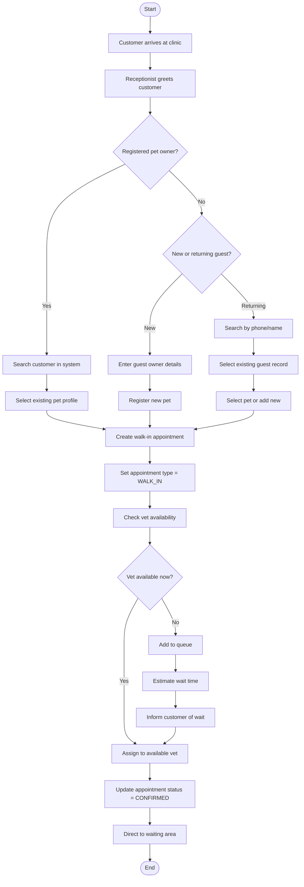
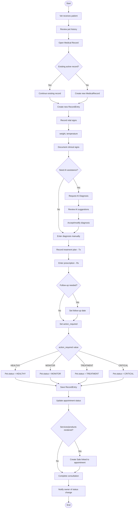
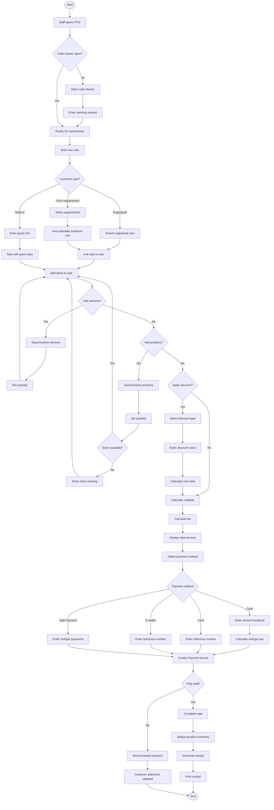
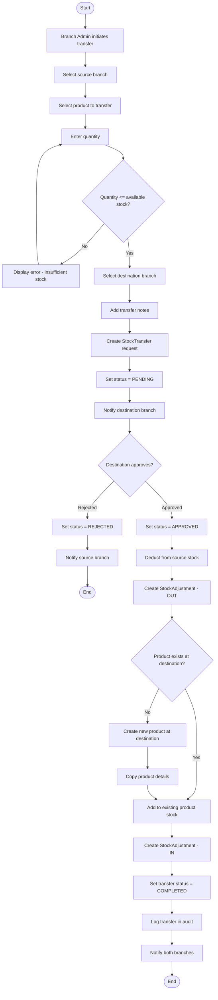
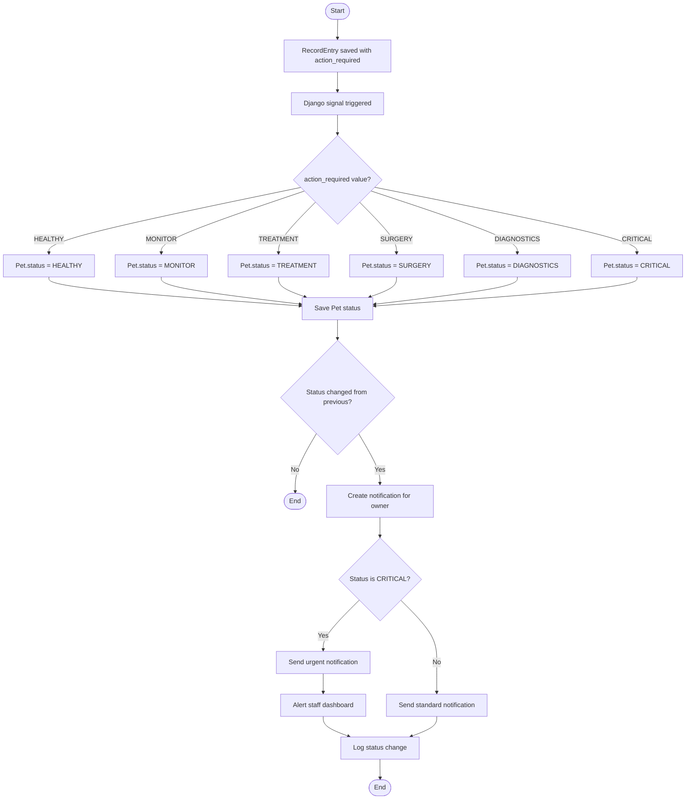
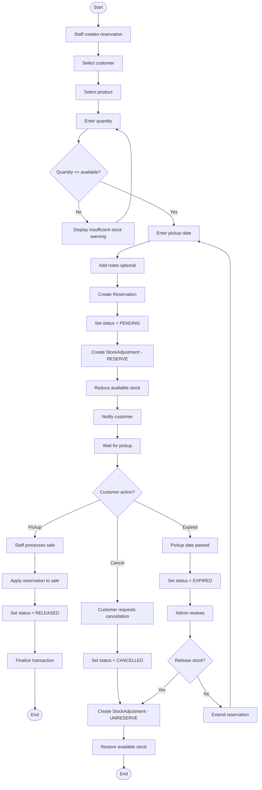
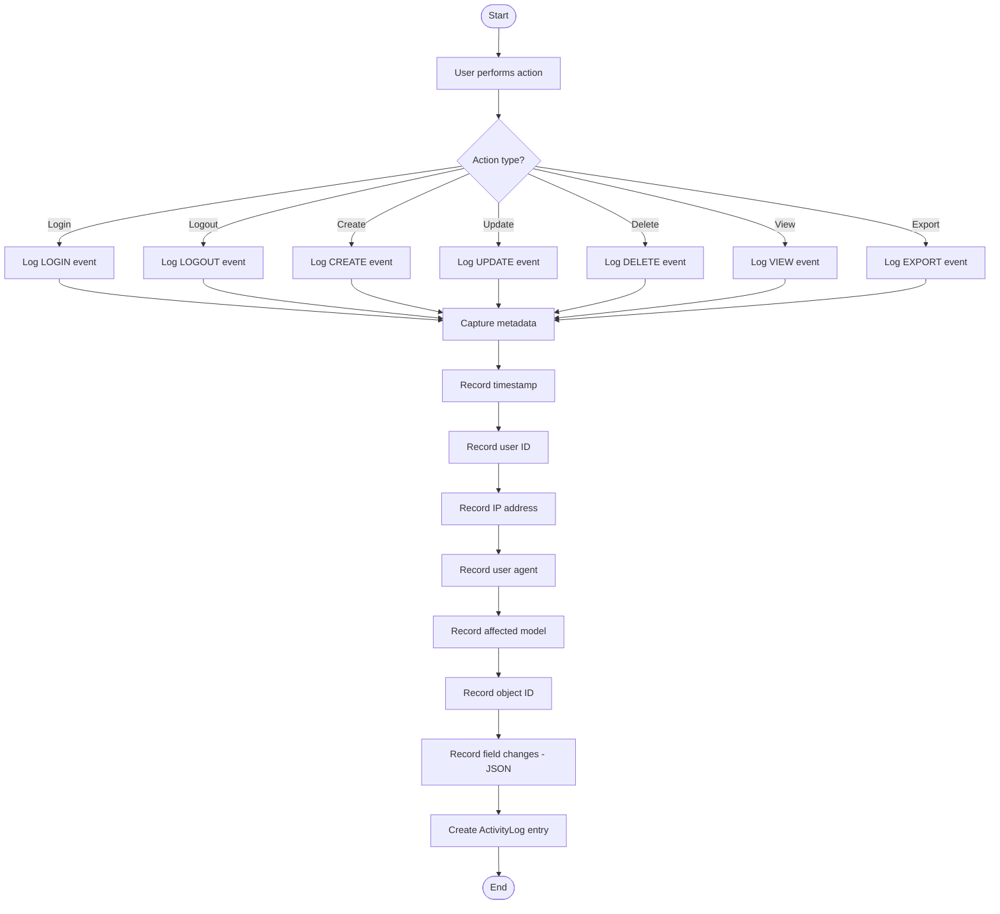
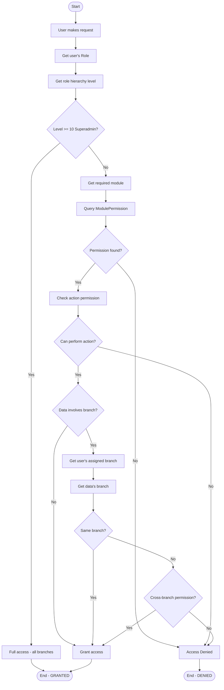

# Process Flow Charts
## FMH Animal Clinic System

---

## Overview

This document contains detailed flow charts for critical business processes in the FMH Animal Clinic system.

---

## 1. User Authentication Flow

```mermaid
flowchart TD
    START([Start]) --> A[User accesses login page]
    A --> B[User enters credentials]
    B --> C{Valid credentials?}
    
    C -->|No| D[Display error message]
    D --> B
    
    C -->|Yes| E{Account active?}
    E -->|No| F[Display "Account disabled" message]
    F --> END1([End])
    
    E -->|Yes| G[Create session]
    G --> H[Log login activity]
    H --> I{Check user role}
    
    I -->|Pet Owner| J[Redirect to Pet Owner Portal]
    I -->|Receptionist| K[Redirect to Reception Dashboard]
    I -->|Veterinarian| L[Redirect to Vet Dashboard]
    I -->|Vet Assistant| L
    I -->|Branch Admin| M[Redirect to Admin Dashboard]
    I -->|Superadmin| N[Redirect to System Admin]
    
    J --> END2([End])
    K --> END2
    L --> END2
    M --> END2
    N --> END2
```

---

## 2. Appointment Booking Flow (Online Portal)

```mermaid
flowchart TD
    START([Start]) --> A[Pet Owner logs in]
    A --> B[Select "Book Appointment"]
    B --> C[Choose Branch]
    C --> D[Select Pet from list]
    D --> E[Choose Service Type]
    E --> F[Select preferred Date]
    F --> G{Date has available slots?}
    
    G -->|No| H[Show "No slots available"]
    H --> F
    
    G -->|Yes| I[Display available time slots]
    I --> J[Select time slot]
    J --> K[Enter reason for visit]
    K --> L[Review appointment details]
    L --> M{Confirm booking?}
    
    M -->|No| C
    M -->|Yes| N[Create Appointment record]
    N --> O[Set status = PENDING]
    O --> P[Denormalize pet/owner data]
    P --> Q[Generate notification to staff]
    Q --> R[Send confirmation email to owner]
    R --> S[Display confirmation page]
    S --> END([End])
```

---

## 3. Walk-in Appointment Flow



---

## 4. Medical Consultation Flow



---

## 5. POS Transaction Flow



---

## 6. Refund Processing Flow

```mermaid
flowchart TD
    START([Start]) --> A[Staff selects original sale]
    A --> B[Click "Process Refund"]
    B --> C{Refund type?}
    
    C -->|Full Refund| D[Select all items]
    C -->|Partial Refund| E[Select specific items]
    E --> F[Enter quantities to refund]
    
    D --> G[Enter refund reason]
    F --> G
    
    G --> H[Calculate refund amount]
    H --> I[Create Refund request]
    I --> J[Set status = PENDING_APPROVAL]
    J --> K[Notify approver]
    K --> L{Approval decision}
    
    L -->|Rejected| M[Set status = REJECTED]
    M --> N[Notify requestor]
    N --> END1([End])
    
    L -->|Approved| O[Set status = APPROVED]
    O --> P[Create RefundItem records]
    P --> Q{Contains products?}
    
    Q -->|Yes| R[Restore product inventory]
    R --> S[Create StockAdjustment - REFUND]
    
    Q -->|No| T[Process refund payment]
    S --> T
    
    T --> U[Update original Sale status]
    U --> V[Set refund status = PROCESSED]
    V --> W[Print refund receipt]
    W --> END2([End])
```

---

## 7. Inventory Stock Transfer Flow



---

## 8. Payroll Processing Flow

```mermaid
flowchart TD
    START([Start]) --> A[Admin opens Payroll module]
    A --> B[Select month and year]
    B --> C{PayrollPeriod exists?}
    
    C -->|Yes| D[Load existing period]
    C -->|No| E[Create new PayrollPeriod]
    E --> F[Set status = DRAFT]
    F --> D
    
    D --> G{Period status?}
    
    G -->|RELEASED| H[View-only mode]
    H --> END1([End])
    
    G -->|DRAFT| I[Click "Generate Payroll"]
    I --> J[Get all active StaffMembers]
    J --> K[Loop: For each staff member]
    
    K --> L[Create Payslip]
    L --> M[Set base salary from StaffMember]
    M --> N{Is 15th payout?}
    
    N -->|Yes| O[Add ₱1000 allowance]
    N -->|No| P{Is 30th payout?}
    P -->|Yes| O
    P -->|No| Q[No allowance split]
    
    O --> R[Calculate statutory deductions]
    Q --> R
    
    R --> S[SSS contribution]
    S --> T[PhilHealth contribution]
    T --> U[PAG-IBIG contribution]
    U --> V[Calculate withholding tax]
    V --> W[Compute net pay]
    W --> X{More staff?}
    
    X -->|Yes| K
    X -->|No| Y[Update PayrollPeriod totals]
    
    Y --> Z[Set status = GENERATED]
    Z --> AA[Log generation in audit]
    AA --> AB[Review payslips]
    
    AB --> AC{Need adjustments?}
    AC -->|Yes| AD[Modify individual payslips]
    AD --> AE[Overtime, bonus, deductions]
    AE --> AF[Recalculate net pay]
    AF --> AB
    
    AC -->|No| AG[Click "Release Payroll"]
    AG --> AH{All payslips approved?}
    
    AH -->|No| AI[Approve pending payslips]
    AI --> AG
    
    AH -->|Yes| AJ[Set period status = RELEASED]
    AJ --> AK[Set all payslips status = RELEASED]
    AK --> AL[Send email to each employee]
    AL --> AM[Log release in audit]
    AM --> END2([End])
```

---

## 9. Pet Status Monitoring Flow



---

## 10. Product Reservation Flow



---

## 11. User Activity Logging Flow



---

## 12. Branch Permission Check Flow



---

## Summary

These flow charts cover the critical business processes:

| # | Process | Purpose |
|---|---------|---------|
| 1 | User Authentication | Login and role-based redirect |
| 2 | Online Appointment Booking | Pet owner portal booking |
| 3 | Walk-in Appointment | Reception handling of walk-ins |
| 4 | Medical Consultation | Full vet consultation workflow |
| 5 | POS Transaction | Complete sales process |
| 6 | Refund Processing | Handling returns and refunds |
| 7 | Stock Transfer | Inter-branch inventory movement |
| 8 | Payroll Processing | Monthly payroll generation and release |
| 9 | Pet Status Monitoring | Automatic status sync from records |
| 10 | Product Reservation | Reserve and release workflow |
| 11 | Activity Logging | Audit trail capture |
| 12 | Branch Permission Check | RBAC enforcement |
